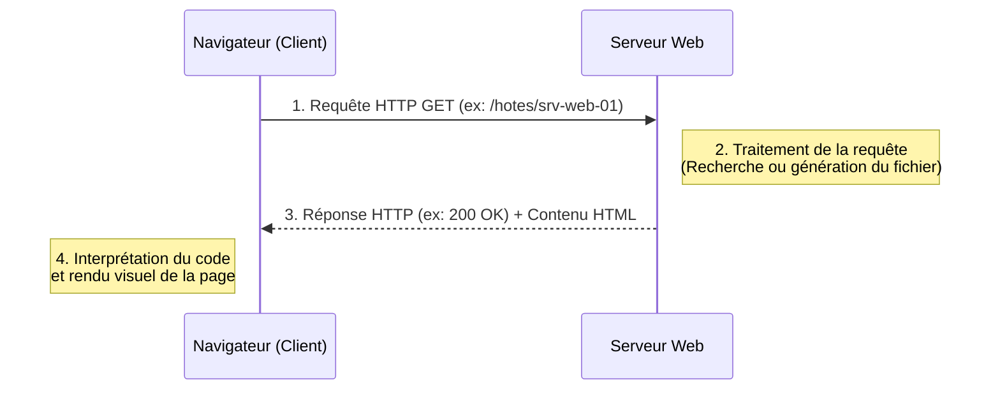
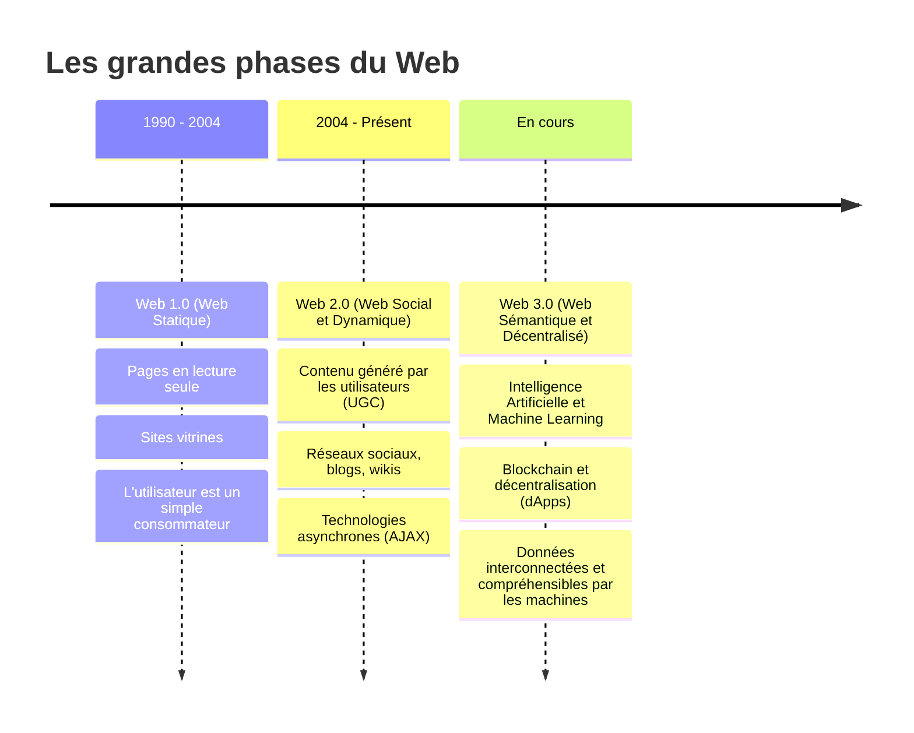

# 1-1-1-Introduction au Web : historique, concepts clés

## 1. Historique du Web

Le World Wide Web (ou simplement "le Web") a été inventé en **1989** par le chercheur britannique **Tim Berners-Lee** alors qu'il travaillait au CERN (Organisation européenne pour la recherche nucléaire). Son objectif initial était de concevoir un système permettant aux scientifiques du monde entier de partager et de mettre à jour facilement des informations.

**Dates clés :**
*   **1990 :** Tim Berners-Lee développe les trois technologies fondamentales du Web (HTML, URI/URL, HTTP) et crée le premier navigateur/éditeur web ainsi que le premier serveur web (`httpd`).
*   **1993 :** Le CERN annonce que le code source du Web est placé dans le domaine public, garantissant son accès gratuit et universel. C'est le point de départ de son adoption massive.
*   **1994 :** Création du **W3C** (World Wide Web Consortium) par Tim Berners-Lee pour développer des standards ouverts et assurer la compatibilité des technologies web à long terme.

## 2. Les concepts clés du Web

Le Web n'est pas Internet. Internet est l'infrastructure réseau mondiale (les câbles, les routeurs), tandis que le Web est un service qui fonctionne *sur* Internet. Le Web repose sur le modèle **Client-Serveur** et trois piliers techniques :

1.  **URL (Uniform Resource Locator) / URI :** Le système d'adressage unique permettant de localiser une ressource (page, image, vidéo) sur le réseau.
    *   *Exemple :* `https://supervision.monreseau.local/hotes/srv-web-01`
2.  **HTTP (HyperText Transfer Protocol) :** Le protocole de communication définissant comment les messages sont formatés et transmis entre le client et le serveur.
3.  **HTML (HyperText Markup Language) :** Le langage de balisage utilisé pour structurer et lier les documents entre eux via des liens hypertextes.

### Le modèle Client-Serveur en action

Lorsqu'un administrateur consulte l'interface web d'un outil de supervision, un dialogue s'établit entre son navigateur (le client) et la machine hébergeant l'outil (le serveur).

## 3. L'évolution du Web : du 1.0 au 3.0

Le Web a connu plusieurs phases d'évolution majeures, modifiant la façon dont les utilisateurs interagissent avec l'information.

*   **Exemple Web 1.0 :** Une page d'état interne, écrite à la main en HTML, affichant la liste des serveurs et leurs adresses IP, sans aucune interaction possible.
*   **Exemple Web 2.0 :** Une interface de supervision web (type Nagios, Zabbix ou Centreon) ou un wiki interne (GLPI, DokuWiki), où les administrateurs saisissent des commentaires d'incident et enrichissent eux-mêmes le contenu.
*   **Exemple Web 3.0 :** Une plateforme d'observabilité qui utilise l'IA pour corréler automatiquement les alertes de tout le parc et anticiper les pannes, ou une infrastructure pilotée par API (Infrastructure as Code) fonctionnant sans intervention manuelle.

---
**Sources utilisées :**
*   *CERN - The birth of the Web* (home.cern/science/computing/the-birth-of-the-web)
*   *World Wide Web Foundation - History of the Web* (webfoundation.org/about/vision/history-of-the-web)
*   *W3C (World Wide Web Consortium)* (w3.org)