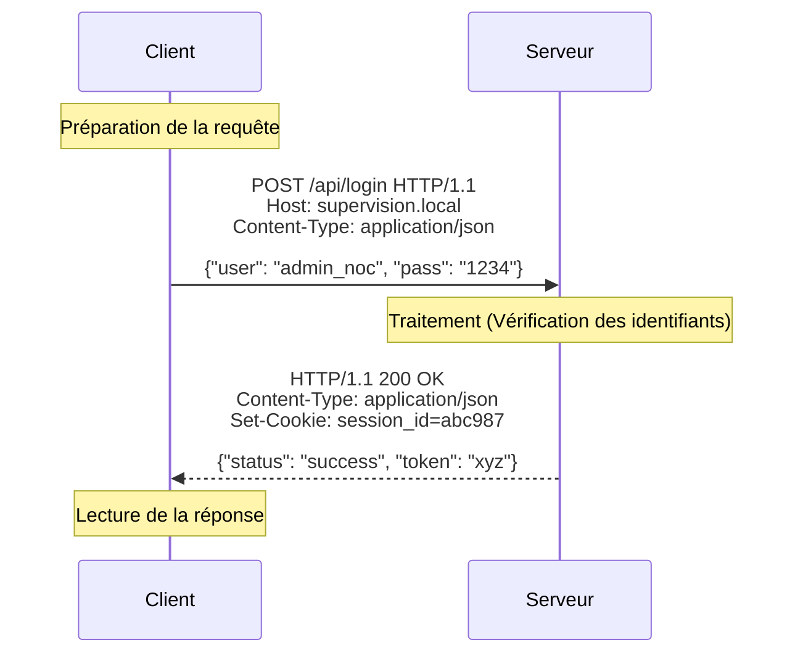

# 1-1-2-Le protocole HTTP en détail

Le protocole HTTP (HyperText Transfer Protocol) est le langage de communication du Web. Il définit la manière dont un client (généralement un navigateur) et un serveur s'échangent des données. Cet échange se fait toujours sous la forme d'une **requête** envoyée par le client, suivie d'une **réponse** renvoyée par le serveur.

## 1. Les Ressources et les URL

Dans l'architecture Web, tout élément manipulable (un document HTML, une image, une vidéo, un objet JSON représentant un équipement réseau) est appelé une **ressource**. 

Chaque ressource est identifiée de manière unique par une **URL** (Uniform Resource Locator).
*   *Exemple :* `https://api.supervision.local/equipements/123` cible la ressource "équipement numéro 123" (par exemple le switch `sw-access-03`).

## 2. Les Méthodes HTTP et l'Idempotence

La méthode HTTP (ou "verbe") indique au serveur l'action que le client souhaite effectuer sur la ressource ciblée.

### Les méthodes principales

*   **GET :** Demande la lecture (récupération) d'une ressource. Ne modifie pas les données sur le serveur.
    *   *Exemple :* Récupérer l'état d'un switch supervisé.
*   **POST :** Soumet des données au serveur pour créer une nouvelle ressource ou déclencher un traitement.
    *   *Exemple :* Enregistrer un nouvel équipement dans l'inventaire.
*   **PUT :** Remplace intégralement une ressource existante par les données fournies, ou la crée si elle n'existe pas.
    *   *Exemple :* Remplacer toute la configuration d'une interface réseau.
*   **DELETE :** Supprime la ressource spécifiée.
    *   *Exemple :* Retirer un équipement de l'inventaire.

### Le concept d'Idempotence

Une méthode HTTP est dite **idempotente** si l'effet sur le serveur d'une requête unique est identique à l'effet de cette même requête répétée plusieurs fois. C'est une garantie de sécurité en cas de problème réseau (le client peut renvoyer la requête sans risque).

*   **GET, PUT, DELETE sont idempotentes.** 
    *   Si vous supprimez l'équipement 123 (`DELETE /equipements/123`), qu'il soit supprimé une fois ou que vous répétiez la commande 10 fois, le résultat final est le même : l'équipement 123 n'existe plus dans l'inventaire.
*   **POST n'est pas idempotente.** 
    *   Si vous envoyez 3 fois la même requête `POST /equipements` pour ajouter "sw-access-03", le serveur risque de créer 3 entrées distinctes pour le même switch.

## 3. Les Codes de Statut (Réponses)

Le serveur inclut un code de statut à 3 chiffres dans sa réponse pour indiquer le résultat de la requête. Ils sont classés par familles :

*   **2xx (Succès) :** L'action a été reçue, comprise et acceptée.
    *   `200 OK` : Succès standard (ex: état de l'équipement trouvé et renvoyé).
    *   `201 Created` : Succès et création d'une nouvelle ressource (souvent après un POST, ex: équipement ajouté à l'inventaire).
*   **3xx (Redirection) :** Le client doit accomplir une action supplémentaire.
    *   `301 Moved Permanently` : La ressource a changé d'URL de façon définitive.
*   **4xx (Erreur du client) :** La requête contient une erreur ou ne peut être traitée.
    *   `400 Bad Request` : Syntaxe de la requête invalide.
    *   `401 Unauthorized` : Authentification requise (ex: accès à l'API de supervision sans jeton valide).
    *   `404 Not Found` : La ressource demandée n'existe pas (ex: équipement inconnu).
*   **5xx (Erreur du serveur) :** Le serveur a échoué à traiter une requête valide.
    *   `500 Internal Server Error` : Erreur générique côté serveur (ex: bug dans le code Python).

## 4. Les En-têtes (Headers)

Les en-têtes HTTP permettent de transmettre des métadonnées supplémentaires entre le client et le serveur. Ils se présentent sous la forme de paires `Nom: Valeur`.

### En-têtes de requête courants
*   **`Host` :** (Obligatoire en HTTP/1.1) Indique le nom de domaine du serveur cible. Utile si un serveur héberge plusieurs sites.
*   **`User-Agent` :** Identifie le client (navigateur, système d'exploitation, version). Permet au serveur d'adapter la réponse (ex: version mobile). C'est aussi cet en-tête qu'envoie un outil en ligne de commande comme `curl` lorsqu'il interroge une API.
*   **`Authorization` :** Contient les informations d'authentification (ex: un jeton/token) pour prouver l'identité du client, par exemple pour accéder à l'API de supervision.

### En-têtes de requête et de réponse
*   **`Content-Type` :** Indique le format des données envoyées dans le corps (body) du message.
    *   *Exemples :* `text/html` (page web), `application/json` (données d'API), `application/x-www-form-urlencoded` (formulaire standard).

## 5. Anatomie d'un échange HTTP

---
**Sources utilisées :**
*   *MDN Web Docs - HTTP Methods* (developer.mozilla.org/en-US/docs/Web/HTTP/Methods)
*   *MDN Web Docs - HTTP Status Codes* (developer.mozilla.org/en-US/docs/Web/HTTP/Status)
*   *MDN Web Docs - Idempotent* (developer.mozilla.org/en-US/docs/Glossary/Idempotent)
*   *RFC 9110: HTTP Semantics* (httpwg.org/specs/rfc9110.html)