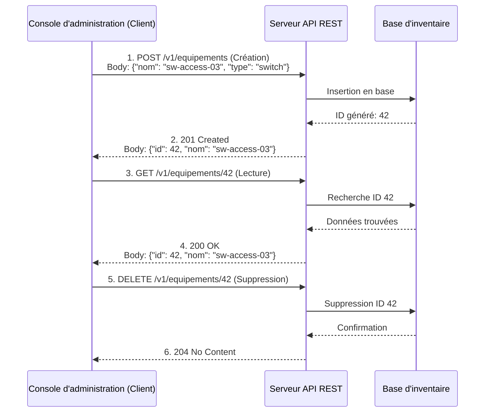

# 1-1-3-Bonnes pratiques du Web et conventions RESTful

REST (Representational State Transfer) est un style d'architecture logicielle défini par Roy Fielding en 2000. Une API qui respecte les principes REST est qualifiée de **RESTful**. Elle permet à des systèmes hétérogènes de communiquer de manière standardisée, prévisible et évolutive via le protocole HTTP. C'est exactement de cette manière que la plupart des outils de supervision et des équipements modernes exposent leurs données.

## 1. Architecture orientée "Ressources"

Dans une API RESTful, tout est centré sur les **ressources** (les entités manipulées : équipements, interfaces, alertes) et non sur les actions. 

**Règle d'or :** Les URL (ou URI) doivent utiliser des **noms** (au pluriel par convention) et **jamais de verbes**. L'action à effectuer est définie par la méthode HTTP (GET, POST, etc.).

*   ❌ **Mauvais (orienté action) :** `/getEquipements`, `/createEquipement`, `/deleteInterface?id=5`
*   ✅ **Bon (orienté ressource) :** `/equipements`, `/interfaces/5`

### Hiérarchie et relations
Les URL doivent refléter la structure logique et hiérarchique des données.
*   *Exemple :* Pour accéder aux interfaces de l'équipement 123 : `GET /equipements/123/interfaces`

## 2. Correspondance Méthodes HTTP et opérations CRUD

REST utilise les méthodes HTTP standard pour réaliser les opérations de base sur les données, souvent résumées par l'acronyme **CRUD** (Create, Read, Update, Delete).

| Opération CRUD | Méthode HTTP | Exemple d'URL (Endpoint) | Description |
| :--- | :--- | :--- | :--- |
| **C**reate | `POST` | `/equipements` | Enregistre un nouvel équipement. |
| **R**ead | `GET` | `/equipements` ou `/equipements/123` | Récupère la liste des équipements ou un équipement précis. |
| **U**pdate | `PUT` / `PATCH` | `/equipements/123` | Remplace (`PUT`) ou modifie partiellement (`PATCH`) l'équipement 123. |
| **D**elete | `DELETE` | `/equipements/123` | Retire l'équipement 123 de l'inventaire. |

## 3. Les principes fondamentaux de conception

### A. Communication sans état (Stateless)
Chaque requête envoyée par le client au serveur doit contenir toutes les informations nécessaires pour être comprise et traitée (ex: un token d'authentification). Le serveur ne doit stocker aucun "contexte de session" entre deux requêtes. Cela rend l'API facilement scalable (mise à l'échelle).

### B. Pagination, Filtrage et Tri
Lorsqu'une ressource contient beaucoup d'éléments (ex: `/equipements`), il ne faut pas tout renvoyer d'un coup pour des raisons de performances. On utilise les paramètres d'URL (Query Strings) pour affiner la requête.
*   *Pagination :* `GET /equipements?page=2&limit=50`
*   *Filtrage :* `GET /equipements?type=switch`
*   *Tri :* `GET /equipements?sort=derniere_vue:desc`

### C. Versioning (Gestion des versions)
Une API évolue. Pour ne pas "casser" les applications clientes existantes lors d'une mise à jour majeure, il faut versionner l'API. La méthode la plus courante est de l'inclure dans l'URL.
*   *Exemple :* `https://api.supervision.local/v1/equipements` puis `https://api.supervision.local/v2/equipements`

### D. Utilisation correcte des codes de statut HTTP
Une API RESTful doit utiliser les codes HTTP standard pour indiquer le résultat de l'opération, plutôt que de renvoyer un code `200 OK` contenant un message d'erreur dans le corps de la réponse.
*   Succès : `200 OK`, `201 Created`, `204 No Content` (souvent utilisé après un DELETE réussi).
*   Erreur client : `400 Bad Request`, `401 Unauthorized`, `403 Forbidden`, `404 Not Found`.

## 4. Exemple d'interaction RESTful

---
**Sources utilisées :**
*   *Microsoft Azure Architecture Center - Best practices for RESTful web API design* (learn.microsoft.com/en-us/azure/architecture/best-practices/api-design)
*   *Daily.dev - RESTful API Design Best Practices Guide 2024* (daily.dev/blog/restful-api-design-best-practices-guide-2024)