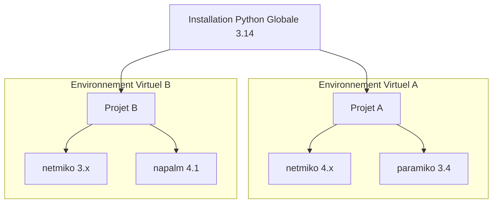

# 1-2-1-Installation de Python 3.14 et environnements virtuels

Python 3.14 (dont la sortie officielle est prévue pour octobre 2025 selon le calendrier du PEP 745) apporte son lot d'optimisations et de nouvelles fonctionnalités. Avant de pouvoir développer, il est nécessaire de l'installer correctement sur votre machine et de comprendre un concept fondamental : les environnements virtuels.

## 1. Installation de Python 3.14

La méthode d'installation varie selon votre système d'exploitation.

### Sous Windows et macOS
1. Rendez-vous sur le site officiel : [python.org/downloads](https://www.python.org/downloads/).
2. Téléchargez l'installateur correspondant à Python 3.14.
3. Lancez l'installateur.
   * ⚠️ **Étape critique sous Windows :** Cochez impérativement la case **"Add Python 3.14 to PATH"** (Ajouter Python au PATH) en bas de la première fenêtre avant de cliquer sur "Install Now". Cela permet d'exécuter Python depuis n'importe quel terminal.

### Sous Linux (Ubuntu/Debian)
Les distributions Linux intègrent souvent Python par défaut, mais pas forcément la dernière version. Pour installer spécifiquement la 3.14, vous pouvez utiliser un dépôt tiers (comme `deadsnakes`) ou compiler depuis les sources.
```bash
sudo add-apt-repository ppa:deadsnakes/ppa
sudo apt update
sudo apt install python3.14
```

### Vérification de l'installation
Ouvrez votre terminal (ou Invite de commandes) et tapez :
```bash
python --version
# ou sous certains systèmes Linux/macOS :
python3.14 --version
```
Si l'installation a réussi, le terminal affichera `Python 3.14.x`.

## 2. Les Environnements Virtuels (venv)

### Pourquoi utiliser un environnement virtuel ?
Imaginons que vous mainteniez deux scripts d'automatisation sur votre machine d'administration :
* Le **Projet A** (supervision) utilise la bibliothèque `netmiko` en version 4.x pour se connecter en SSH à vos switchs.
* Le **Projet B** (audit hérité) utilise `netmiko` en version 3.x, imposée par un ancien script que vous ne pouvez pas encore migrer.

Si vous installez `netmiko` globalement sur votre système, les deux scripts devront partager la même version, ce qui créera inévitablement des conflits et des bugs. 

Un **environnement virtuel** résout ce problème en créant un espace isolé pour chaque projet. Chaque environnement possède son propre interpréteur Python et son propre dossier de bibliothèques.



### Créer et utiliser un environnement virtuel

Python intègre nativement le module `venv` pour gérer ces environnements.

**Étape 1 : Création**
Placez-vous dans le dossier de votre projet via le terminal, puis exécutez la commande suivante :
```bash
python -m venv mon_environnement
```
*Explication :* On demande à Python (`python`) d'exécuter le module venv (`-m venv`) pour créer un dossier nommé `mon_environnement` (vous pouvez le nommer comme vous le souhaitez, `env` ou `.venv` sont très courants).

**Étape 2 : Activation**
Avant d'installer des bibliothèques ou d'exécuter votre code, vous devez "activer" cet environnement. La commande dépend de votre système :

* **Sous Windows (Invite de commandes) :**
  ```cmd
  mon_environnement\Scripts\activate.bat
  ```
* **Sous Windows (PowerShell) :**
  ```powershell
  mon_environnement\Scripts\Activate.ps1
  ```
* **Sous macOS et Linux :**
  ```bash
  source mon_environnement/bin/activate
  ```

Une fois activé, le nom de votre environnement apparaîtra entre parenthèses au début de la ligne de votre terminal, par exemple : `(mon_environnement) C:\Users\Projet>`. 
Toutes les installations (via `pip install`, par exemple `pip install netmiko`) se feront désormais de manière isolée dans ce dossier.

**Étape 3 : Désactivation**
Pour quitter l'environnement virtuel et revenir au Python global de votre système, tapez simplement :
```bash
deactivate
```

---
**Sources utilisées :**
*   *Documentation officielle Python - venv* (docs.python.org/3/library/venv.html)
*   *PEP 745 – Python 3.14 Release Schedule* (peps.python.org/pep-0745/)