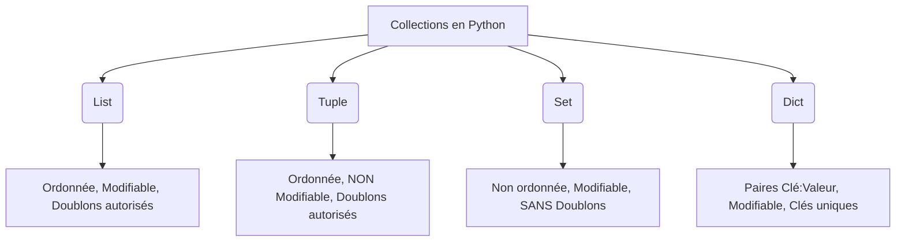

# 1-2-2-Variables, types de données et opérateurs en Python

Python est un langage à **typage dynamique fort**. Cela signifie que vous n'avez pas besoin de déclarer explicitement le type d'une variable lors de sa création (dynamique), mais que Python ne permet pas d'additionner des types incompatibles comme un texte et un nombre sans conversion explicite (fort).

## 1. Les Variables

Une variable est un espace en mémoire utilisé pour stocker une donnée. En Python, l'assignation se fait avec le signe `=`.

```python
# Création de variables
ttl = 64
hostname = "srv-web-01"
hote_joignable = True

# Python 3.14 (et versions récentes) encourage l'utilisation des "Type Hints" (indications de type)
# pour rendre le code plus lisible, bien que cela reste optionnel :
ttl: int = 64
hostname: str = "srv-web-01"
```

## 2. Les Types de données primitifs

Python propose plusieurs types de base pour manipuler des données simples :

*   **`int` (Entier) :** Nombres entiers, sans limite de taille.
    *   *Exemple :* `port_ssh = 22`
*   **`float` (Flottant) :** Nombres à virgule (séparée par un point).
    *   *Exemple :* `latence_ms = 19.99`
*   **`str` (Chaîne de caractères) :** Texte entouré de guillemets simples ou doubles.
    *   *Exemple :* `adresse_ip = "192.168.1.10"`
*   **`bool` (Booléen) :** Valeur de vérité, prend uniquement `True` ou `False` (avec une majuscule).
    *   *Exemple :* `interface_active = False`

## 3. Les Structures de données (Collections)

Pour stocker plusieurs éléments dans une seule variable, Python propose 4 structures de données principales, chacune ayant ses spécificités.



### A. La Liste (`list`)
Définie par des crochets `[]`. Elle est modifiable (mutable).
```python
serveurs = ["srv-web-01", "srv-dns-01", "srv-dhcp-01"]
serveurs.append("srv-mail-01") # Ajoute un élément à la fin
serveurs[0] = "srv-web-02"     # Modifie le premier élément (index 0)
```

### B. Le Tuple (`tuple`)
Défini par des parenthèses `()`. Il est **immuable** (impossible de le modifier après création). Très utile pour des données qui ne doivent pas changer (ex: un couple adresse IP / port, appelé "socket").
```python
adresse_socket = ("192.168.1.10", 22)
# adresse_socket[1] = 443 -> Provoquera une erreur !
```

### C. L'Ensemble (`set`)
Défini par des accolades `{}`. Il ne contient **aucun doublon** et n'est pas ordonné (pas d'index). Très performant pour vérifier si un élément existe.
```python
ips_sources = {"192.168.1.10", "192.168.1.20", "192.168.1.10"}
print(ips_sources) # Affichera {"192.168.1.10", "192.168.1.20"} (le doublon est ignoré)
```

### D. Le Dictionnaire (`dict`)
Défini par des accolades `{}` contenant des paires `clé: valeur`. Permet d'associer une étiquette à une donnée.
```python
hote = {
    "hostname": "srv-web-01",
    "ip": "192.168.1.10",
    "os": "Debian 12"
}
print(hote["hostname"]) # Affiche "srv-web-01"
hote["ip"] = "192.168.1.11"   # Mise à jour de la valeur
```

## 4. Les Opérateurs

Les opérateurs permettent de manipuler les variables et leurs valeurs.

### Opérateurs arithmétiques
*   Addition : `+`
*   Soustraction : `-`
*   Multiplication : `*`
*   Division (renvoie un float) : `/`
*   Division entière (renvoie un int) : `//`
*   Modulo (reste de la division) : `%`
*   Puissance : `**`

```python
adresses_totales = 2 ** 8   # 256 adresses dans un /24
dernier_octet_pair = 10 % 2 # 0 (le reste est nul, donc l'octet est pair)
```

### Opérateurs de comparaison
Ils renvoient toujours un booléen (`True` ou `False`).
*   Égalité : `==` (Attention à ne pas confondre avec `=` qui est l'assignation)
*   Différence : `!=`
*   Supérieur / Inférieur : `>`, `<`, `>=`, `<=`

### Opérateurs logiques
Permettent de combiner plusieurs conditions.
*   **`and`** : Vrai si toutes les conditions sont vraies.
*   **`or`** : Vrai si au moins une condition est vraie.
*   **`not`** : Inverse le résultat (Vrai devient Faux).

```python
latence_ms = 20
hote_joignable = True

# Vérifie si l'hôte est considéré comme opérationnel
est_operationnel = hote_joignable and (latence_ms < 100) # Résultat: True
```

---
**Sources utilisées :**
*   *Documentation officielle Python - Built-in Types* (docs.python.org/3/library/stdtypes.html)
*   *W3Schools - Python Data Types* (w3schools.com/python/python_datatypes.asp)