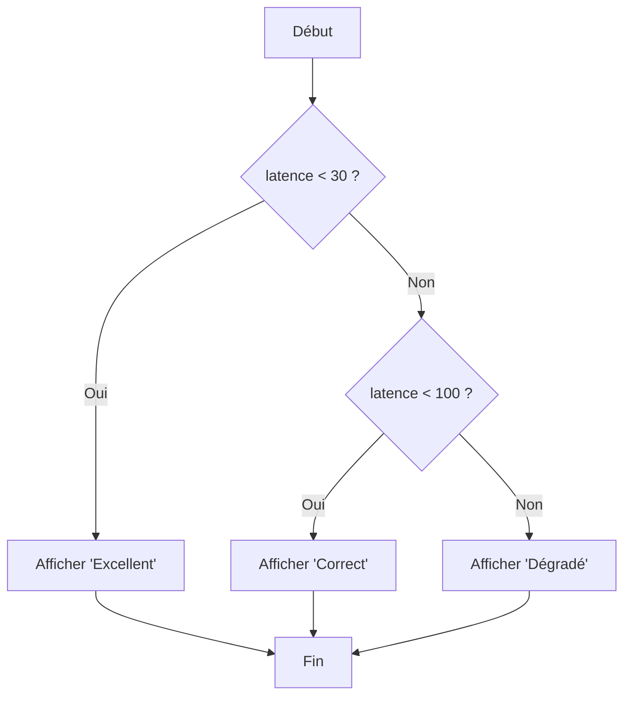

# 1-2-3-Structures de contrôle en Python

Les structures de contrôle permettent de modifier l'ordre d'exécution des instructions dans un programme. Elles se divisent en deux grandes catégories : les conditions (prises de décision) et les boucles (répétitions).

## 1. Les instructions conditionnelles (`if`, `elif`, `else`)

L'instruction `if` (si) permet d'exécuter un bloc de code uniquement si une condition est évaluée à `True` (Vrai). 
On peut la compléter avec `elif` (sinon si) pour tester d'autres conditions, et `else` (sinon) pour exécuter un code par défaut si aucune condition précédente n'est remplie.

**Syntaxe et indentation :** En Python, les blocs de code sont définis par l'indentation (généralement 4 espaces). Il n'y a pas d'accolades `{}`.

```python
latence_ms = 20

if latence_ms < 30:
    print("État : Excellent")
elif latence_ms < 100:
    print("État : Correct")
else:
    print("État : Dégradé")
```



## 2. La boucle `for` (Itération sur une séquence)

Contrairement à d'autres langages où la boucle `for` est souvent un compteur numérique, la boucle `for` en Python itère directement sur les éléments d'une séquence (une liste, un tuple, un dictionnaire, ou une chaîne de caractères).

```python
# Itération sur une liste de serveurs à vérifier
serveurs = ["srv-web-01", "srv-dns-01", "srv-dhcp-01"]
for serveur in serveurs:
    print(f"Vérification de {serveur}...")

# Itération avec un compteur généré par range()
# range(5) génère les nombres de 0 à 4
for i in range(5):
    print(f"Tentative de connexion n°{i}")
```

## 3. La boucle `while` (Répétition sous condition)

La boucle `while` (tant que) exécute un bloc de code en boucle tant qu'une condition donnée reste `True`. Elle est utile lorsque le nombre d'itérations n'est pas connu à l'avance.

⚠️ **Attention :** Il faut s'assurer que la condition finisse par devenir `False`, sinon le programme entrera dans une boucle infinie.

```python
tentatives = 3

while tentatives > 0:
    print(f"Nouvelle tentative de connexion... ({tentatives} restantes)")
    tentatives -= 1  # Équivalent à : tentatives = tentatives - 1

print("Connexion abandonnée.")
```

## 4. Altérer le flux des boucles : `break` et `continue`

Python propose deux mots-clés pour modifier le comportement standard des boucles `for` et `while` :

*   **`break` :** Interrompt immédiatement et définitivement la boucle, même si la condition est encore vraie ou qu'il reste des éléments à parcourir.
*   **`continue` :** Interrompt l'itération *en cours* et passe directement à l'itération suivante.

```python
# Balayage d'une plage de ports : on ignore un port connu et on arrête à un port cible
for port in range(20, 26):
    if port == 22:
        continue  # On saute le port SSH (déjà connu comme ouvert)
    if port == 25:
        break     # On arrête le scan dès qu'on atteint le port 25 (SMTP)
    print(f"Test du port {port}")

# Résultat affiché : 20, 21, 23, 24
```

---
**Sources utilisées :**
*   *Documentation officielle Python 3.14 - More Control Flow Tools* (docs.python.org/3/tutorial/controlflow.html)
*   *Real Python - Control Flow Structures in Python* (realpython.com/python-control-flow)