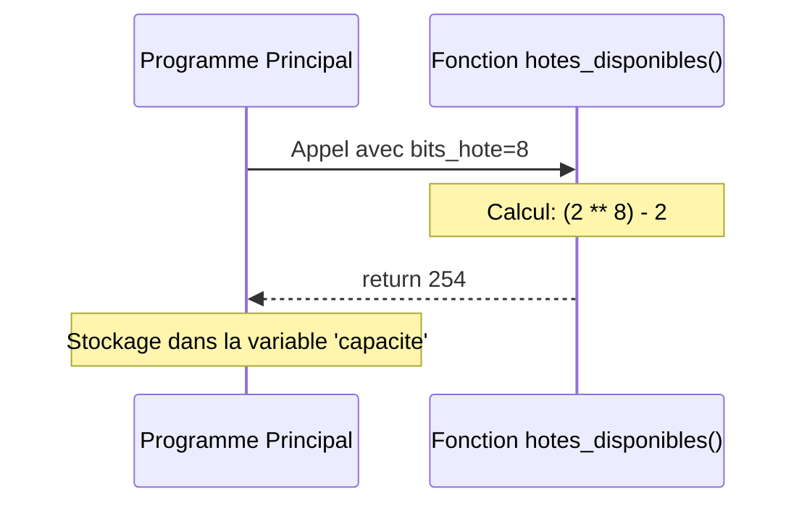

# 1-2-4-Fonctions : définition, arguments, valeurs de retour, lambda

Les fonctions sont des blocs de code réutilisables conçus pour effectuer une tâche spécifique. Elles permettent de structurer un programme, d'éviter la répétition de code (principe DRY : *Don't Repeat Yourself*) et de rendre le code plus lisible.

## 1. Définition et appel d'une fonction

En Python, une fonction se définit à l'aide du mot-clé `def`, suivi du nom de la fonction, de parenthèses `()` et de deux-points `:`. Le corps de la fonction doit être indenté.

```python
# Définition de la fonction
def afficher_entete():
    print("=== Rapport de supervision réseau ===")

# Appel de la fonction
afficher_entete() 
```

## 2. Les Arguments

Les arguments (ou paramètres) permettent de transmettre des données à une fonction pour qu'elle les traite. Python offre une grande flexibilité dans leur gestion.

### A. Arguments positionnels et nommés
Par défaut, les arguments sont assignés dans l'ordre de leur définition (positionnels). On peut aussi utiliser le nom de l'argument lors de l'appel pour s'affranchir de l'ordre (nommés).

```python
def decrire_hote(hostname, ip):
    print(f"L'hôte {hostname} a pour adresse {ip}.")

decrire_hote("srv-web-01", "192.168.1.10")             # Positionnel
decrire_hote(ip="192.168.1.20", hostname="srv-dns-01") # Nommé (l'ordre n'importe plus)
```

### B. Arguments par défaut
Vous pouvez définir une valeur par défaut pour un argument. S'il n'est pas fourni lors de l'appel, cette valeur sera utilisée.

```python
def configurer_interface(nom_interface, active=True):
    print(f"Interface: {nom_interface}, Active: {active}")

configurer_interface("GigabitEthernet0/1")        # Utilise active=True par défaut
configurer_interface("GigabitEthernet0/2", False) # Écrase la valeur par défaut
```

### C. Nombre variable d'arguments (`*args` et `**kwargs`)
*   `*args` permet de passer un nombre indéfini d'arguments positionnels (ils sont regroupés dans un tuple).
*   `**kwargs` permet de passer un nombre indéfini d'arguments nommés (ils sont regroupés dans un dictionnaire).

```python
def total_paquets(*compteurs):
    total = 0
    for c in compteurs:
        total += c
    return total

print(total_paquets(1500, 2300, 800, 1200)) # Affiche 5800
```

## 3. Les Valeurs de retour (`return`)

Une fonction peut renvoyer un résultat au code qui l'a appelée grâce au mot-clé `return`. Dès que `return` est exécuté, la fonction s'arrête. Si une fonction n'a pas de `return`, elle renvoie implicitement `None`.

```python
def hotes_disponibles(bits_hote):
    # Nombre d'adresses utilisables dans un sous-réseau
    # (on retire l'adresse réseau et l'adresse de broadcast)
    return (2 ** bits_hote) - 2

capacite = hotes_disponibles(8)  # 8 bits d'hôte, comme dans un /24
print(f"Hôtes adressables : {capacite}") # Affiche 254
```



## 4. Les Fonctions anonymes (`lambda`)

Les fonctions `lambda` sont de petites fonctions créées en une seule ligne, sans utiliser `def` et sans nom (d'où le terme "anonyme"). Elles sont idéales pour des opérations simples et éphémères, souvent passées en argument à d'autres fonctions (comme `sort()`, `map()`, ou `filter()`).

**Syntaxe :** `lambda arguments: expression`

*Note : Une fonction lambda ne contient qu'une seule expression, dont le résultat est automatiquement renvoyé (pas besoin de `return`).*

```python
# Fonction classique
def carre(x):
    return x ** 2

# Équivalent en lambda
carre_lambda = lambda x: x ** 2

print(carre_lambda(5)) # Affiche 25

# Cas d'usage fréquent : trier une liste de dictionnaires selon une clé spécifique
hotes = [
    {"nom": "srv-web-01", "latence": 30},
    {"nom": "srv-dns-01", "latence": 12},
    {"nom": "srv-dhcp-01", "latence": 21}
]

# On trie la liste en se basant sur la valeur de la clé "latence"
hotes_tries = sorted(hotes, key=lambda h: h["latence"])
# Résultat : srv-dns-01 (12), srv-dhcp-01 (21), srv-web-01 (30)
```

---
**Sources utilisées :**
*   *Documentation officielle Python - Defining Functions* (docs.python.org/3/tutorial/controlflow.html#defining-functions)
*   *Documentation officielle Python - Lambda Expressions* (docs.python.org/3/tutorial/controlflow.html#lambda-expressions)
*   *Real Python - Defining Your Own Python Function* (realpython.com/defining-your-own-python-function)