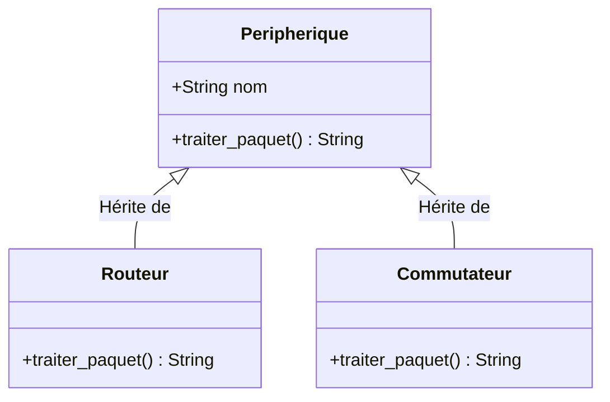

# 1-2-5-Programmation Orientée Objet : classes, objets, attributs, méthodes, héritage, encapsulation, polymorphisme

La Programmation Orientée Objet (POO) est un paradigme de programmation qui consiste à modéliser des concepts du monde réel sous forme d'entités informatiques appelées **objets**. 

## 1. Classes et Objets

*   **Classe :** C'est un plan de construction, un moule. Elle définit les caractéristiques et les comportements qu'auront les objets créés à partir d'elle.
*   **Objet (ou Instance) :** C'est la concrétisation de la classe. Si la classe est le modèle d'un routeur défini par le constructeur (ses caractéristiques techniques), l'objet est le routeur physique installé dans la baie, avec sa propre adresse IP et son numéro de série.

## 2. Attributs et Méthodes

*   **Attributs :** Ce sont les variables propres à un objet (son état, ses caractéristiques).
*   **Méthodes :** Ce sont les fonctions définies à l'intérieur d'une classe (ses actions, son comportement).

En Python, la méthode spéciale `__init__` est le **constructeur**. Elle est appelée automatiquement lors de la création d'un objet pour initialiser ses attributs. Le mot-clé `self` représente l'instance de l'objet lui-même et doit être le premier paramètre de chaque méthode d'instance.

```python
class Equipement:
    # Constructeur
    def __init__(self, hostname, ip):
        self.hostname = hostname   # Attribut
        self.ip = ip               # Attribut
        self.en_ligne = False      # Attribut par défaut

    # Méthode
    def demarrer(self):
        self.en_ligne = True
        print(f"L'équipement {self.hostname} ({self.ip}) est en ligne.")

# Création d'un objet (instanciation)
mon_routeur = Equipement("rtr-core-01", "10.0.0.1")
mon_routeur.demarrer()
```

## 3. L'Encapsulation

L'encapsulation consiste à restreindre l'accès direct aux attributs d'un objet pour protéger son intégrité. En Python, il n'y a pas de mots-clés stricts comme `private` ou `public`. On utilise des conventions de nommage :
*   `_attribut` (un tiret bas) : Indique que l'attribut est **protégé** (usage interne recommandé, mais techniquement accessible).
*   `__attribut` (deux tirets bas) : Rend l'attribut **privé** via un mécanisme de *name mangling* (difficilement accessible de l'extérieur).

```python
class LienReseau:
    def __init__(self, nom, bande_passante):
        self.nom = nom
        self.__bande_passante_dispo = bande_passante  # Attribut privé (en Mbps)

    def liberer(self, debit):
        if debit > 0:
            self.__bande_passante_dispo += debit

    def get_bande_passante_dispo(self):  # Méthode d'accès (Getter)
        return self.__bande_passante_dispo
```

## 4. L'Héritage

L'héritage permet de créer une nouvelle classe (classe fille) à partir d'une classe existante (classe mère). La classe fille hérite de tous les attributs et méthodes de la classe mère, et peut en ajouter de nouveaux. Cela favorise la réutilisation du code.

On utilise la fonction `super()` pour appeler les méthodes de la classe mère, notamment son constructeur.

## 5. Le Polymorphisme

Le polymorphisme (du grec "plusieurs formes") permet à des classes différentes de posséder des méthodes portant le même nom, mais ayant un comportement spécifique à leur classe. Cela se traduit souvent par la **redéfinition** (overriding) d'une méthode héritée.

```python
# Classe Mère
class Peripherique:
    def __init__(self, nom):
        self.nom = nom

    def traiter_paquet(self):
        raise NotImplementedError("Cette méthode doit être redéfinie")

# Classes Filles (Héritage)
class Routeur(Peripherique):
    def traiter_paquet(self): # Polymorphisme : redéfinition de la méthode
        return f"{self.nom} route le paquet vers le prochain saut (couche 3)."

class Commutateur(Peripherique):
    def traiter_paquet(self): # Polymorphisme : redéfinition de la méthode
        return f"{self.nom} commute la trame selon l'adresse MAC (couche 2)."

# Utilisation
equipements = [Routeur("rtr-core-01"), Commutateur("sw-access-02")]
for equipement in equipements:
    print(equipement.traiter_paquet()) 
    # Le code appelant ne se soucie pas du type exact de l'équipement
```

## 6. Diagramme de classes (Héritage et Polymorphisme)



## 7. Note sur Python moderne : Les Dataclasses

Depuis Python 3.7 (et très largement utilisées en Python 3.14), le module `dataclasses` fournit un décorateur `@dataclass`. Il génère automatiquement les méthodes fastidieuses comme `__init__`, `__repr__` ou `__eq__` pour les classes dont le but principal est de stocker des données.

```python
from dataclasses import dataclass

@dataclass
class Interface:
    nom: str
    ip: str
    vlan: int = 1

# Le __init__ est généré automatiquement
eth0 = Interface("GigabitEthernet0/1", "192.168.1.1")
```

---
**Sources utilisées :**
*   *Documentation officielle Python 3.14 - Classes* (docs.python.org/3/tutorial/classes.html)
*   *Documentation officielle Python 3.14 - Dataclasses* (docs.python.org/3/library/dataclasses.html)
*   *Real Python - Object-Oriented Programming (OOP) in Python 3* (realpython.com/python3-object-oriented-programming)