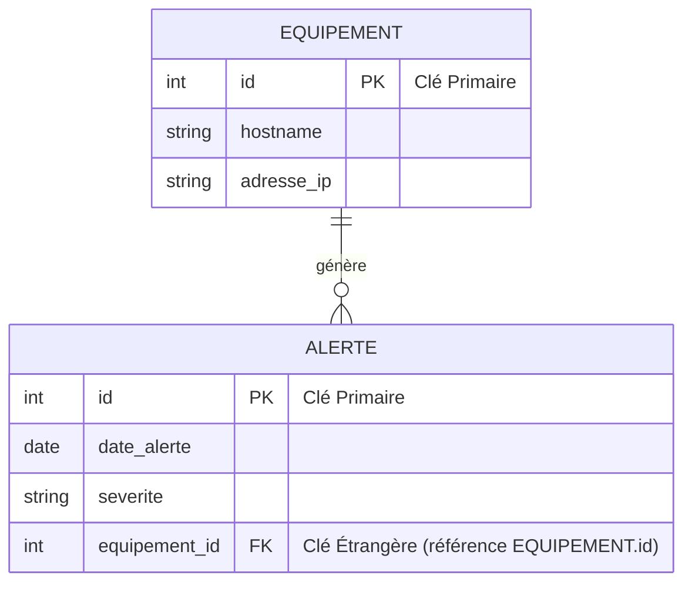

# 2-1-1-Introduction aux bases de données relationnelles

Une base de données relationnelle est un système de stockage qui organise les données sous forme de **tables** (ou relations) structurées en lignes et en colonnes. Ce modèle, théorisé dans les années 1970 par Edgar F. Codd, repose sur l'établissement de liens logiques (relations) entre ces différentes tables.

## 1. Structure fondamentale : Tables, Lignes et Colonnes

Dans un modèle relationnel, chaque type d'entité est représenté par une table spécifique.

*   **La Table :** Représente un concept ou une entité (ex: `Equipements`, `Interfaces`, `Alertes`).
*   **La Colonne (Attribut) :** Définit une propriété de l'entité et son type de donnée (ex: la colonne `latence` de type décimal, la colonne `adresse_ip` de type texte).
*   **La Ligne (Enregistrement ou Tuple) :** Représente une instance unique de l'entité (ex: un équipement précis avec son hostname et son adresse IP).

## 2. Les Clés : Le cœur du modèle relationnel

Pour garantir l'intégrité des données et lier les tables entre elles, le modèle relationnel utilise un système de clés.

### A. La Clé Primaire (Primary Key - PK)
C'est un identifiant **unique** pour chaque ligne d'une table. Elle garantit qu'aucun enregistrement n'est un doublon parfait. Souvent, il s'agit d'un nombre entier qui s'incrémente automatiquement (ex: `id`).

### B. La Clé Étrangère (Foreign Key - FK)
C'est une colonne dans une table qui fait référence à la clé primaire d'une autre table. C'est elle qui crée la **relation**.


*Explication du diagramme : Un équipement peut générer zéro ou plusieurs alertes. Chaque alerte est liée à un seul équipement grâce à la clé étrangère `equipement_id`.*

## 3. Le langage SQL (Structured Query Language)

Pour interagir avec une base de données relationnelle, on utilise le langage standardisé SQL. Il permet d'effectuer les opérations fondamentales dites **CRUD** (Create, Read, Update, Delete) :

*   **Create** : `INSERT INTO` (Ajouter de nouvelles données)
*   **Read** : `SELECT` (Interroger et récupérer des données)
*   **Update** : `UPDATE` (Modifier des données existantes)
*   **Delete** : `DELETE` (Supprimer des données)

*Exemple de requête SQL pour récupérer les alertes de l'équipement ayant l'ID 1 :*
```sql
SELECT date_alerte, severite 
FROM ALERTE 
WHERE equipement_id = 1;
```

## 4. Les SGBDR (Systèmes de Gestion de Bases de Données Relationnelles)

Un SGBDR est le logiciel qui permet de créer, gérer et interroger la base de données. Voici les plus courants dans l'écosystème Python :

*   **SQLite :** Léger, stocke toute la base dans un seul fichier local. Idéal pour le développement, les tests ou les petites applications. Intégré nativement dans Python via le module `sqlite3`.
*   **PostgreSQL :** SGBDR open-source extrêmement puissant, robuste et respectueux des standards SQL. Très utilisé en production avec des frameworks comme Django ou FastAPI.
*   **MySQL / MariaDB :** Très populaires sur le web, souvent associés à la pile LAMP (Linux, Apache, MySQL, PHP), mais parfaitement utilisables avec Python.

---
**Sources utilisées :**
*   *AWS - What is a Relational Database?* (aws.amazon.com/rds/what-is-a-relational-database)
*   *Oracle - Qu'est-ce qu'une base de données relationnelle ?* (oracle.com/fr/database/what-is-a-relational-database/)