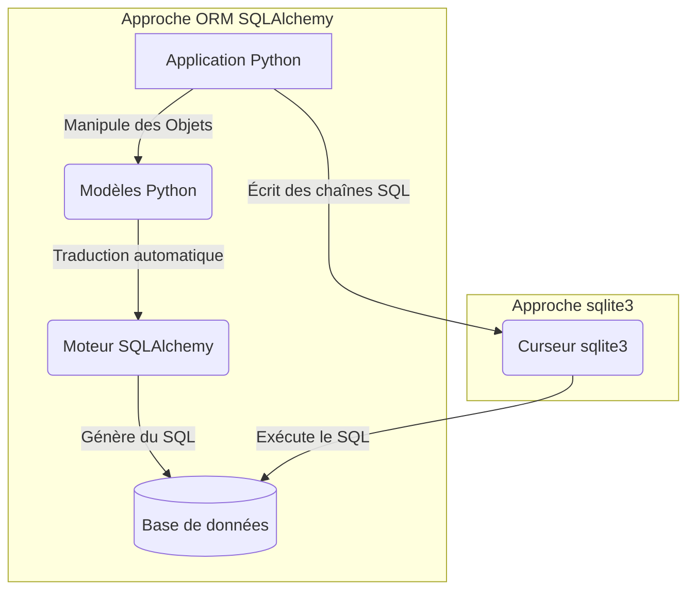

# 2-1-2-SQL en Python : utilisation de `sqlite3` et SQLAlchemy (ORM)

Pour interagir avec une base de données relationnelle en Python, il existe deux grandes approches : écrire directement des requêtes SQL (approche bas niveau) ou utiliser un ORM pour manipuler les données sous forme d'objets Python (approche haut niveau).

## 1. L'approche bas niveau : `sqlite3` (SQL brut)

Python intègre nativement le module `sqlite3`. Il permet de se connecter à une base de données SQLite (qui stocke les données dans un simple fichier local ou en mémoire) et d'exécuter des requêtes SQL classiques sous forme de chaînes de caractères.

**Le flux de travail classique :**
1. Créer une connexion à la base.
2. Créer un curseur (l'objet qui exécute les requêtes).
3. Exécuter la requête SQL.
4. Valider les changements (`commit`) si on modifie les données.
5. Fermer la connexion.

**Exemple d'utilisation :**
```python
import sqlite3

# 1. Connexion à une base de données (créée si elle n'existe pas)
connexion = sqlite3.connect("inventaire.db")
curseur = connexion.cursor()

# 2. Création d'une table avec du SQL brut
curseur.execute("""
    CREATE TABLE IF NOT EXISTS equipement (
        id INTEGER PRIMARY KEY AUTOINCREMENT,
        hostname TEXT NOT NULL
    )
""")

# 3. Insertion d'une donnée (utilisation de '?' pour éviter les injections SQL)
curseur.execute("INSERT INTO equipement (hostname) VALUES (?)", ("srv-web-01",))

# 4. Validation et fermeture
connexion.commit()
connexion.close()
```

## 2. L'approche haut niveau : SQLAlchemy (ORM)

Un **ORM** (Object-Relational Mapper) fait le pont entre le monde de la base de données (tables, colonnes) et le monde de la programmation orientée objet (classes, attributs). Au lieu d'écrire du SQL, vous manipulez des objets Python, et l'ORM se charge de générer et d'exécuter le SQL correspondant en arrière-plan.

**SQLAlchemy** est l'ORM le plus populaire et le plus puissant en Python. Avec sa version 2.0, il utilise massivement le typage statique de Python pour définir les modèles.

**Exemple d'utilisation avec SQLAlchemy 2.0 :**
```python
from sqlalchemy import create_engine, String
from sqlalchemy.orm import DeclarativeBase, Mapped, mapped_column, Session

# 1. Configuration de la base de base pour les modèles
class Base(DeclarativeBase):
    pass

# 2. Définition du modèle (la classe représente la table)
class Equipement(Base):
    __tablename__ = "equipement"
    
    # Définition des colonnes avec le typage Python (Mapped)
    id: Mapped[int] = mapped_column(primary_key=True)
    hostname: Mapped[str] = mapped_column(String(50))

# 3. Connexion au moteur de base de données (ici SQLite en mémoire)
moteur = create_engine("sqlite:///:memory:", echo=False)

# 4. Création des tables dans la base de données
Base.metadata.create_all(moteur)

# 5. Manipulation des données via une Session
with Session(moteur) as session:
    # Création d'un objet Python
    nouvel_equipement = Equipement(hostname="srv-dns-01")
    
    # Ajout et validation
    session.add(nouvel_equipement)
    session.commit()
    
    print(f"Équipement inséré avec l'ID : {nouvel_equipement.id}")
```

## 3. Comparaison des deux approches



*   **`sqlite3` :** Idéal pour des scripts simples, des petits projets ou pour apprendre le SQL. Le code est très proche de la base de données, mais peut devenir difficile à maintenir sur de gros projets (beaucoup de chaînes de caractères SQL éparpillées).
*   **SQLAlchemy :** Idéal pour les applications robustes (API, applications web). Il sécurise le code (prévention des injections SQL), facilite les migrations entre différents moteurs de bases de données (passer de SQLite à PostgreSQL ne demande presque aucun changement de code) et rend le code plus lisible grâce à l'approche objet.

---
**Sources utilisées :**
*   *Documentation officielle Python 3.14 - sqlite3* (docs.python.org/3/library/sqlite3.html)
*   *Documentation officielle SQLAlchemy 2.0 - ORM Quick Start* (docs.sqlalchemy.org/en/20/orm/quickstart.html)