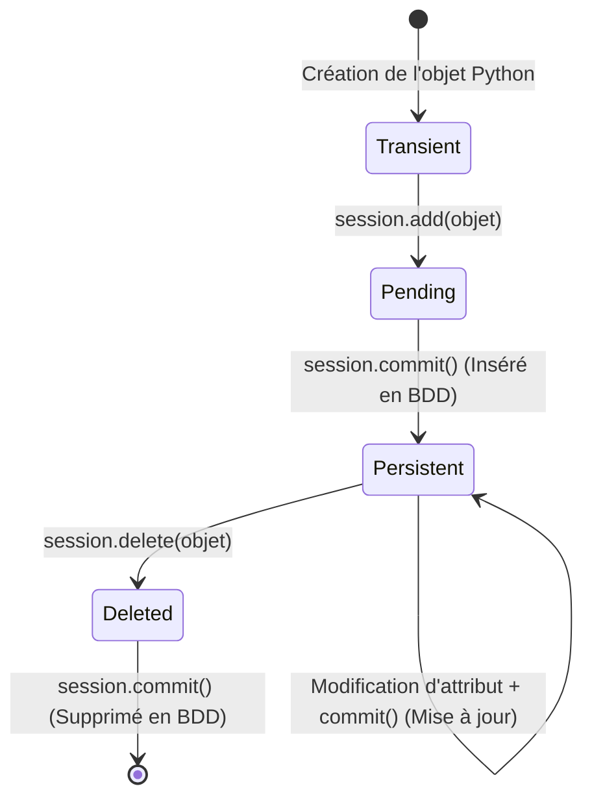

# 2-1-3-Création de tables, insertion, mise à jour, suppression et récupération de données

Les opérations fondamentales sur une base de données sont regroupées sous l'acronyme **CRUD** : Create (Créer), Read (Lire), Update (Mettre à jour) et Delete (Supprimer). 

Nous allons voir comment réaliser ces opérations avec les deux approches vues précédemment : le SQL brut via `sqlite3` et l'ORM via `SQLAlchemy 2.0`.

## 1. Création de la table (Initialisation)

Avant de manipuler des données, il faut définir la structure qui va les accueillir.

**Avec `sqlite3` (SQL brut) :**
```python
import sqlite3

conn = sqlite3.connect("inventaire.db")
cursor = conn.cursor()

# Création de la table 'equipement'
cursor.execute("""
    CREATE TABLE IF NOT EXISTS equipement (
        id INTEGER PRIMARY KEY AUTOINCREMENT,
        hostname TEXT NOT NULL,
        ip TEXT NOT NULL,
        type TEXT NOT NULL,
        latence REAL
    )
""")
conn.commit()
```

**Avec `SQLAlchemy 2.0` (ORM) :**
```python
from sqlalchemy import create_engine, String
from sqlalchemy.orm import DeclarativeBase, Mapped, mapped_column

class Base(DeclarativeBase):
    pass

class Equipement(Base):
    __tablename__ = "equipement"
    id: Mapped[int] = mapped_column(primary_key=True)
    hostname: Mapped[str] = mapped_column(String(50))
    ip: Mapped[str] = mapped_column(String(45))
    type: Mapped[str] = mapped_column(String(20))
    latence: Mapped[float]

engine = create_engine("sqlite:///inventaire.db")
# Crée toutes les tables définies par les classes héritant de Base
Base.metadata.create_all(engine)
```

## 2. CREATE : Insertion de données

L'insertion consiste à ajouter de nouvelles lignes dans la table.

**Avec `sqlite3` :**
```python
# Utilisation de '?' pour sécuriser contre les injections SQL
cursor.execute(
    "INSERT INTO equipement (hostname, ip, type, latence) VALUES (?, ?, ?, ?)", 
    ("srv-web-01", "192.168.1.10", "serveur", 12.50)
)
conn.commit()
```

**Avec `SQLAlchemy 2.0` :**
```python
from sqlalchemy.orm import Session

with Session(engine) as session:
    nouvel_equipement = Equipement(hostname="sw-access-02", ip="192.168.1.2", type="switch", latence=1.20)
    session.add(nouvel_equipement)
    session.commit() # Valide la transaction
```

## 3. READ : Récupération de données

La lecture permet d'interroger la base pour récupérer des enregistrements, souvent en appliquant des filtres.

**Avec `sqlite3` :**
```python
# Récupérer tous les équipements d'un type spécifique
cursor.execute("SELECT id, hostname, latence FROM equipement WHERE type = ?", ("switch",))
equipements = cursor.fetchall() # Retourne une liste de tuples

for equipement in equipements:
    print(f"ID: {equipement[0]}, Hostname: {equipement[1]}, Latence: {equipement[2]} ms")
```

**Avec `SQLAlchemy 2.0` :**
```python
from sqlalchemy import select

with Session(engine) as session:
    # Construction de la requête avec select()
    requete = select(Equipement).where(Equipement.type == "switch")
    
    # Exécution et récupération des objets (scalars)
    equipements = session.scalars(requete).all()
    
    for equipement in equipements:
        print(f"ID: {equipement.id}, Hostname: {equipement.hostname}, Latence: {equipement.latence} ms")
```

## 4. UPDATE : Mise à jour de données

La mise à jour modifie les valeurs d'une ou plusieurs colonnes pour des enregistrements existants.

**Avec `sqlite3` :**
```python
# Mettre à jour la latence de l'équipement ayant l'ID 1
cursor.execute("UPDATE equipement SET latence = ? WHERE id = ?", (14.00, 1))
conn.commit()
```

**Avec `SQLAlchemy 2.0` :**
```python
with Session(engine) as session:
    # 1. Récupérer l'objet
    equipement_a_modifier = session.get(Equipement, 1) # Récupère par clé primaire
    
    if equipement_a_modifier:
        # 2. Modifier l'attribut Python
        equipement_a_modifier.latence = 14.00
        # 3. Valider (SQLAlchemy détecte le changement automatiquement)
        session.commit()
```

## 5. DELETE : Suppression de données

La suppression retire définitivement des enregistrements de la table.

**Avec `sqlite3` :**
```python
# Supprimer l'équipement ayant l'ID 1
cursor.execute("DELETE FROM equipement WHERE id = ?", (1,))
conn.commit()
```

**Avec `SQLAlchemy 2.0` :**
```python
with Session(engine) as session:
    equipement_a_supprimer = session.get(Equipement, 1)
    
    if equipement_a_supprimer:
        session.delete(equipement_a_supprimer)
        session.commit()
```

## Synthèse du cycle de vie d'une transaction (ORM)



---
**Sources utilisées :**
*   *Documentation officielle Python 3.14 - sqlite3* (docs.python.org/3/library/sqlite3.html)
*   *Documentation officielle SQLAlchemy 2.0 - ORM Querying Guide* (docs.sqlalchemy.org/en/20/orm/queryguide/index.html)
*   *Documentation officielle SQLAlchemy 2.0 - ORM Quick Start* (docs.sqlalchemy.org/en/20/orm/quickstart.html)