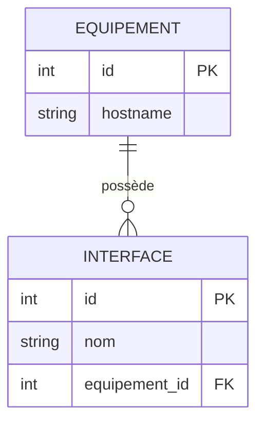

# 2-1-4-Modélisation de données simples

La modélisation de données est l'étape de conception qui permet de structurer les informations d'une application avant de les stocker dans une base de données. Une bonne modélisation garantit l'intégrité des données, évite la redondance et optimise les performances des requêtes.

## 1. Les concepts clés de la modélisation

La modélisation repose sur l'identification de trois éléments fondamentaux :
*   **Les Entités :** Les objets ou concepts principaux de votre application (ex: `Equipement`, `Interface`, `Site`). Elles deviendront les tables.
*   **Les Attributs :** Les propriétés qui décrivent une entité (ex: `hostname`, `adresse_ip`, `date_mise_en_service`). Ils deviendront les colonnes.
*   **Les Relations :** Les liens logiques qui unissent les entités entre elles.

## 2. Les types de relations

Il existe trois grands types de relations entre les tables dans une base de données relationnelle :

### A. One-to-Many (Un-à-Plusieurs)
C'est la relation la plus courante. Un enregistrement de la table A peut être lié à plusieurs enregistrements de la table B, mais un enregistrement de la table B n'est lié qu'à un seul enregistrement de la table A.
*Exemple : Un `Equipement` possède plusieurs `Interfaces`, mais une `Interface` appartient à un seul `Equipement`.*

### B. Many-to-Many (Plusieurs-à-Plusieurs)
Un enregistrement de la table A peut être lié à plusieurs enregistrements de la table B, et inversement. Ce type de relation nécessite la création d'une **table de liaison** (ou table d'association) intermédiaire.
*Exemple : Un `Equipement` peut appartenir à plusieurs `VLAN`, et un `VLAN` regroupe plusieurs `Equipements`.*

### C. One-to-One (Un-à-Un)
Un enregistrement de la table A est lié à un seul enregistrement de la table B, et inversement. Souvent utilisé pour séparer des données confidentielles ou optionnelles.
*Exemple : Un `Equipement` possède une seule `Configuration` détaillée (identifiants d'accès, communauté SNMP...).*

## 3. Diagramme Entité-Relation (One-to-Many)

Voici la modélisation d'une relation "Un-à-Plusieurs" entre un Équipement et ses Interfaces.



## 4. Implémentation avec SQLAlchemy 2.0

Avec l'ORM SQLAlchemy 2.0, la modélisation se fait via des classes Python. On utilise `ForeignKey` pour définir la contrainte au niveau de la base de données, et la fonction `relationship()` pour naviguer facilement entre les objets en Python (relation bidirectionnelle via `back_populates`).

**Exemple d'une relation One-to-Many (Equipement -> Interfaces) :**

```python
from typing import List
from sqlalchemy import ForeignKey, String
from sqlalchemy.orm import DeclarativeBase, Mapped, mapped_column, relationship

class Base(DeclarativeBase):
    pass

# Entité "Côté Un" (Parent)
class Equipement(Base):
    __tablename__ = "equipement"
    
    id: Mapped[int] = mapped_column(primary_key=True)
    hostname: Mapped[str] = mapped_column(String(50))
    
    # Relation vers les interfaces (Une liste d'objets Interface)
    interfaces: Mapped[List["Interface"]] = relationship(back_populates="equipement")

# Entité "Côté Plusieurs" (Enfant)
class Interface(Base):
    __tablename__ = "interface"
    
    id: Mapped[int] = mapped_column(primary_key=True)
    nom: Mapped[str] = mapped_column(String(50))
    
    # Clé étrangère pointant vers la table 'equipement'
    equipement_id: Mapped[int] = mapped_column(ForeignKey("equipement.id"))
    
    # Relation inverse vers l'équipement (Un objet Equipement)
    equipement: Mapped["Equipement"] = relationship(back_populates="interfaces")
```

**Utilisation des objets liés :**
Grâce à `relationship()`, SQLAlchemy gère automatiquement les jointures en arrière-plan.

```python
# Création d'un équipement et de ses interfaces en une seule fois
nouvel_equipement = Equipement(hostname="sw-access-02")
nouvel_equipement.interfaces = [
    Interface(nom="GigabitEthernet0/1"),
    Interface(nom="GigabitEthernet0/2")
]

# En ajoutant l'équipement à la session, SQLAlchemy insère aussi les interfaces
# et gère automatiquement les clés étrangères (equipement_id).
```

## 5. Les règles de Normalisation (Bases)

Pour obtenir une modélisation saine, on applique généralement les règles de normalisation (Formes Normales) :
1.  **1NF (Première Forme Normale) :** Chaque colonne doit contenir une valeur atomique (indivisible). Pas de liste d'adresses IP séparées par des virgules dans une seule colonne.
2.  **2NF (Deuxième Forme Normale) :** Tous les attributs doivent dépendre entièrement de la clé primaire.
3.  **3NF (Troisième Forme Normale) :** Les attributs ne doivent pas dépendre d'autres attributs non-clés (pas de données calculables ou déductibles stockées en dur).

---
**Sources utilisées :**
*   *Documentation officielle SQLAlchemy 2.0 - Basic Relationship Patterns* (docs.sqlalchemy.org/en/20/orm/basic_relationships.html)
*   *IBM - What is Data Modeling?* (ibm.com/topics/data-modeling)