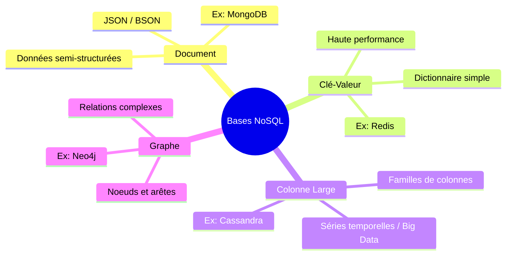

# 2-2-1-Introduction aux bases de données NoSQL : types (document, clé-valeur, colonne large)

Les bases de données NoSQL (Not Only SQL) ont émergé pour répondre aux limites des bases de données relationnelles traditionnelles face à l'explosion du volume, de la vélocité et de la variété des données. Contrairement au modèle relationnel strict (tables, lignes, colonnes), le NoSQL propose des schémas flexibles, conçus pour la scalabilité horizontale et les hautes performances.

Il existe plusieurs familles de bases de données NoSQL, chacune optimisée pour des cas d'usage spécifiques.

## 1. Bases de données Orientées Document

Dans ce modèle, les données sont stockées sous forme de documents (généralement au format JSON, BSON ou XML). Chaque document contient des paires clé-valeur, mais contrairement à une simple base clé-valeur, la valeur peut être une structure complexe (tableaux, sous-documents imbriqués).

*   **Avantage :** Le schéma est flexible (schema-less). Deux documents dans une même collection peuvent avoir des structures différentes, ce qui facilite les évolutions de l'application.
*   **Cas d'usage :** Gestion de contenu (CMS), catalogues de produits e-commerce, profils utilisateurs.
*   **Exemples :** MongoDB, Couchbase, Amazon DocumentDB.

**Exemple de document (JSON) :**
```json
{
  "id_utilisateur": "u123",
  "nom": "Dupont",
  "prenom": "Jean",
  "tags": ["python", "nosql", "data"],
  "adresse": {
    "ville": "Paris",
    "code_postal": "75001"
  }
}
```

## 2. Bases de données Clé-Valeur (Key-Value)

C'est le modèle NoSQL le plus simple. Chaque élément de la base est stocké sous la forme d'une paire constituée d'une **clé unique** et de sa **valeur** associée. La base de données ne cherche pas à comprendre le contenu de la "valeur" (qui est traitée comme un objet opaque par le moteur).

*   **Avantage :** Extrêmement rapide pour les opérations de lecture/écriture basées sur la clé (complexité O(1)).
*   **Cas d'usage :** Mise en cache (caching), gestion des sessions utilisateurs, paniers d'achat temporaires.
*   **Exemples :** Redis, Amazon DynamoDB, Memcached.

**Exemple conceptuel :**
*   **Clé :** `session:987654`
*   **Valeur :** `{"user_id": 42, "last_login": "2023-10-25", "theme": "dark"}`

## 3. Bases de données à Colonnes Larges (Wide-Column)

Contrairement aux bases relationnelles qui stockent les données ligne par ligne, ce modèle stocke les données par **familles de colonnes**. Une ligne est identifiée par une clé, mais chaque ligne peut posséder un nombre et des types de colonnes différents.

*   **Avantage :** Très performant pour les requêtes d'agrégation sur de grands volumes de données et excellente scalabilité sur plusieurs serveurs (architecture distribuée).
*   **Cas d'usage :** Analyse de séries temporelles (données IoT), historiques d'événements (logs), recommandations en temps réel.
*   **Exemples :** Apache Cassandra, HBase, Google Cloud Bigtable.

**Exemple conceptuel :**

| Row Key (ID) | Famille: Profil (Colonnes) | Famille: Activité (Colonnes) |
| :--- | :--- | :--- |
| `user_1` | `nom: "Alice"`, `age: 28` | `derniere_connexion: "10:00"`, `clics: 45` |
| `user_2` | `nom: "Bob"` | `achats: 2` |

*(Notez que `user_2` n'a pas de colonne `age` ni `derniere_connexion`, ce qui ne pose aucun problème de stockage).*

## 4. Synthèse des modèles NoSQL


*(Note : Le modèle Graphe est un 4ème type majeur de NoSQL, spécialisé dans les relations hautement interconnectées comme les réseaux sociaux ou la détection de fraude).*

---
**Sources utilisées :**
*   *AWS - Types of NoSQL databases* (docs.aws.amazon.com/whitepapers/latest/choosing-an-aws-nosql-database/types-of-nosql-databases.html)
*   *MongoDB - What is NoSQL?* (mongodb.com/nosql-explained)