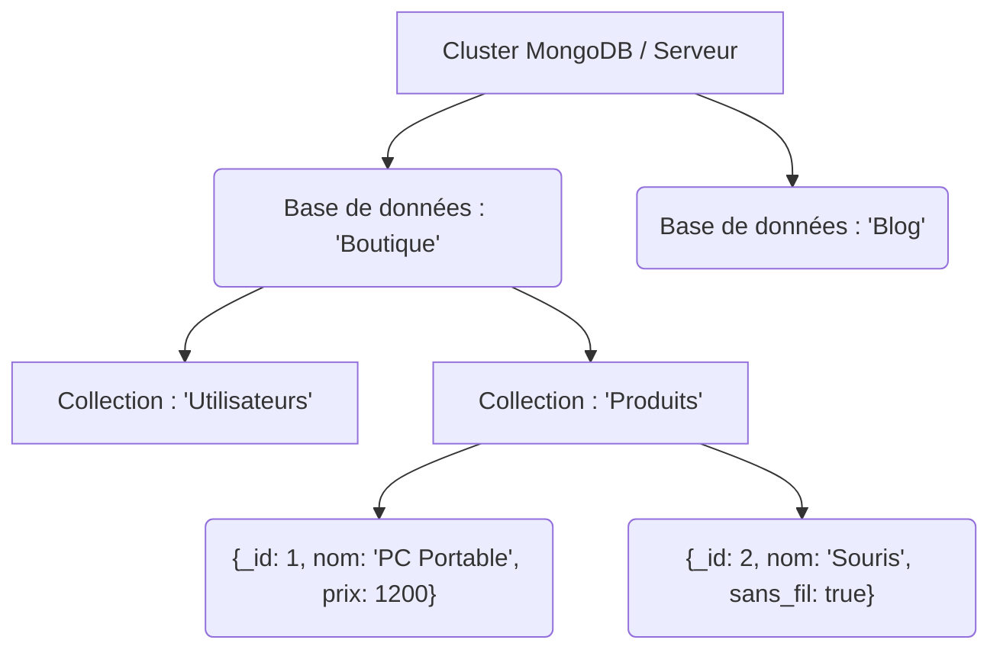

# 2-2-2-Découverte de MongoDB (base de données orientée document)

MongoDB est le système de gestion de base de données NoSQL orienté document le plus populaire. Conçu pour offrir de hautes performances, une haute disponibilité et une mise à l'échelle automatique, il s'affranchit du modèle relationnel strict.

## 1. Le concept de Document et le format BSON

Dans MongoDB, l'unité fondamentale de données n'est pas une ligne dans une table, mais un **document**. 

Un document ressemble fortement à un objet JSON (JavaScript Object Notation), composé de paires clé-valeur. Cependant, sous le capot, MongoDB stocke ces documents dans un format binaire appelé **BSON** (Binary JSON). Le BSON permet une recherche plus rapide et supporte des types de données supplémentaires par rapport au JSON classique (comme les dates, les données binaires ou les nombres à virgule flottante spécifiques).

**Exemple de structure d'un document MongoDB :**
```json
{
  "_id": ObjectId("507f1f77bcf86cd799439011"),
  "titre": "Apprendre Python",
  "auteur": "Jeanne Dupont",
  "tags": ["programmation", "python", "nosql"],
  "disponible": true,
  "details": {
    "pages": 350,
    "langue": "Français"
  }
}
```
*Note : Le champ `_id` est obligatoire et unique pour chaque document. Si vous ne le fournissez pas, MongoDB génère automatiquement un `ObjectId`.*

## 2. L'architecture : Comparaison avec le monde SQL

Pour bien comprendre MongoDB, il est utile de faire le parallèle avec les bases de données relationnelles (SQL) :

| Concept SQL (Relationnel) | Concept MongoDB (Document) | Description |
| :--- | :--- | :--- |
| Base de données | **Base de données** | Conteneur physique pour les données. |
| Table | **Collection** | Un regroupement de documents. Contrairement à une table, une collection n'impose pas de schéma strict (schema-less). |
| Ligne (Row) | **Document** | L'enregistrement de la donnée elle-même. |
| Colonne | **Champ (Field)** | Une paire clé-valeur dans le document. |
| Jointure (JOIN) | **Document imbriqué / Référence** | Les données liées sont souvent stockées directement à l'intérieur du même document (imbrication) ou liées par des références. |

## 3. Hiérarchie des données dans MongoDB


*Ce diagramme illustre la flexibilité du schéma : dans la collection `Produits`, les deux documents n'ont pas exactement la même structure (le deuxième a un champ `sans_fil` que le premier n'a pas).*

## 4. MongoDB et Python : Le pilote PyMongo

Pour interagir avec MongoDB depuis une application Python, on utilise le pilote officiel : **PyMongo**. Il permet de se connecter à la base de données et de manipuler les documents en utilisant directement les dictionnaires (`dict`) et les listes (`list`) natifs de Python, ce qui rend l'intégration extrêmement naturelle.

*Aperçu du fonctionnement avec Python :*
```python
# Les dictionnaires Python se traduisent directement en documents BSON
nouveau_produit = {
    "nom": "Clavier Mécanique",
    "prix": 85.50,
    "stock": 15,
    "caracteristiques": ["RGB", "AZERTY"]
}

# L'insertion se fait via PyMongo (la syntaxe exacte sera vue dans le chapitre suivant)
# collection.insert_one(nouveau_produit)
```

---
**Sources utilisées :**
*   *MongoDB Documentation - PyMongo Tutorial* (mongodb.com/resources/languages/pymongo-tutorial)
*   *MongoDB Documentation - Introduction to MongoDB* (mongodb.com/docs/manual/introduction/)