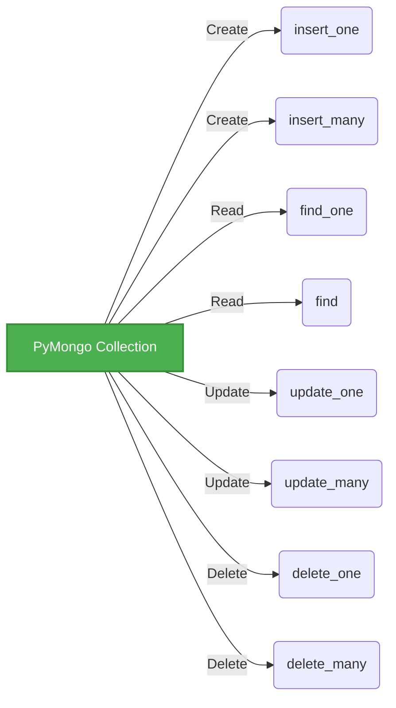

# 2-2-3-Utilisation de `pymongo` pour interagir avec MongoDB : connexion et opérations CRUD

Pour manipuler une base de données MongoDB depuis Python, la bibliothèque standard et officielle est `pymongo`. Elle permet d'effectuer toutes les opérations CRUD (Create, Read, Update, Delete) en utilisant des structures de données natives de Python (dictionnaires et listes).

## 1. Connexion à la base de données

La première étape consiste à établir une connexion avec le serveur MongoDB via la classe `MongoClient`, puis à sélectionner la base de données et la collection.

```python
from pymongo import MongoClient

# 1. Connexion au serveur MongoDB (ici en local sur le port par défaut)
client = MongoClient("mongodb://localhost:27017/")

# 2. Sélection de la base de données (créée automatiquement si elle n'existe pas)
db = client["mabase_ecommerce"]

# 3. Sélection de la collection (équivalent d'une table en SQL)
collection_produits = db["produits"]
```

## 2. CREATE : Insertion de documents

PyMongo propose deux méthodes principales pour ajouter des données : `insert_one()` pour un seul document et `insert_many()` pour plusieurs.

**Exemple d'insertion :**
```python
# Insertion d'un seul document
nouveau_produit = {
    "nom": "Écran 27 pouces",
    "prix": 250.00,
    "stock": 45,
    "tags": ["informatique", "bureau"]
}
resultat = collection_produits.insert_one(nouveau_produit)
print(f"ID du document inséré : {resultat.inserted_id}")

# Insertion de plusieurs documents
liste_produits = [
    {"nom": "Souris sans fil", "prix": 25.99, "stock": 100},
    {"nom": "Clavier mécanique", "prix": 89.50, "stock": 30}
]
resultat_multi = collection_produits.insert_many(liste_produits)
print(f"IDs insérés : {resultat_multi.inserted_ids}")
```

## 3. READ : Recherche de documents

Pour interroger la base, on utilise `find_one()` (retourne le premier document correspondant) ou `find()` (retourne un curseur itérable contenant tous les documents correspondants). Les filtres de recherche s'écrivent sous forme de dictionnaires.

**Exemple de recherche :**
```python
# Trouver un document spécifique
produit = collection_produits.find_one({"nom": "Souris sans fil"})
print(produit)

# Trouver tous les produits dont le prix est supérieur à 50 (utilisation de l'opérateur $gt)
# $gt = greater than, $lt = less than
produits_chers = collection_produits.find({"prix": {"$gt": 50}})

for p in produits_chers:
    print(f"{p['nom']} - {p['prix']}€")
```

## 4. UPDATE : Mise à jour de documents

Les méthodes `update_one()` et `update_many()` prennent deux paramètres obligatoires :
1.  Le **filtre** pour cibler les documents.
2.  L'**opération de mise à jour**, souvent précédée de l'opérateur `$set` pour modifier ou ajouter des champs sans écraser tout le document.

**Exemple de mise à jour :**
```python
# Mettre à jour le prix d'un produit spécifique
collection_produits.update_one(
    {"nom": "Écran 27 pouces"}, # Filtre
    {"$set": {"prix": 220.00}}  # Modification
)

# Ajouter un champ "en_promotion" à tous les produits ayant un stock > 50
collection_produits.update_many(
    {"stock": {"$gt": 50}},
    {"$set": {"en_promotion": True}}
)
```

## 5. DELETE : Suppression de documents

De la même manière, `delete_one()` supprime le premier document correspondant au filtre, et `delete_many()` supprime tous les documents qui y correspondent.

**Exemple de suppression :**
```python
# Supprimer un produit précis
collection_produits.delete_one({"nom": "Souris sans fil"})

# Supprimer tous les produits dont le stock est à 0
resultat_suppression = collection_produits.delete_many({"stock": 0})
print(f"Nombre de documents supprimés : {resultat_suppression.deleted_count}")
```

## Synthèse des opérations PyMongo



---
**Sources utilisées :**
*   *Documentation officielle MongoDB - PyMongo Driver CRUD Operations* (mongodb.com/docs/languages/python/pymongo-driver/current/crud/)
*   *OneUptime - How to Perform CRUD Operations with PyMongo* (oneuptime.com/blog/post/2026-03-31-mongodb-crud-pymongo/view)