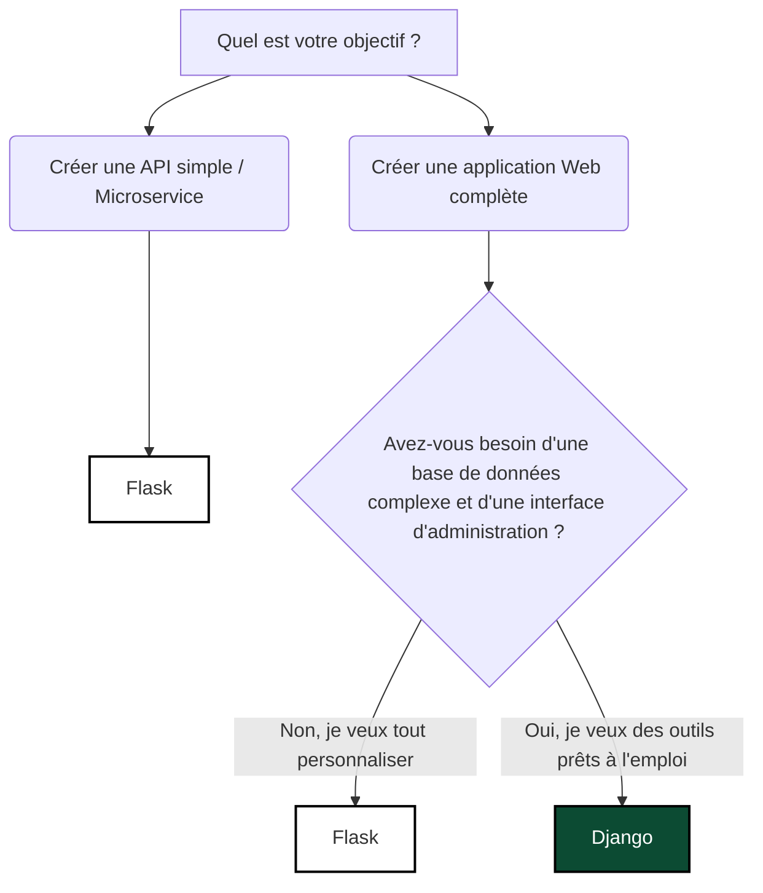

# 3-1-1-Avantages et inconvénients de Flask vs Django (cas d'utilisation)

Dans l'écosystème Python, **Django** et **Flask** sont les deux frameworks web les plus populaires. Bien qu'ils servent tous deux à créer des applications web et des API, leur philosophie de conception est diamétralement opposée. 

Django est un framework **"batteries included"** (tout inclus), tandis que Flask est un **micro-framework**.

## 1. Flask : Le Micro-framework

Flask fournit uniquement les outils essentiels pour faire fonctionner une application web (routage et moteur de template). Pour le reste (base de données, authentification, validation de formulaires), c'est au développeur de choisir et d'intégrer des bibliothèques tierces.

### Avantages de Flask
*   **Légèreté et flexibilité :** Vous avez un contrôle total sur les composants que vous utilisez. Vous n'êtes pas contraint par les choix du framework.
*   **Courbe d'apprentissage douce :** Le code de base pour lancer un serveur Flask tient en 5 lignes. Il est très facile à comprendre pour les débutants.
*   **Idéal pour les microservices :** Sa légèreté en fait un excellent candidat pour des API simples et rapides ou des architectures basées sur les microservices.

### Inconvénients de Flask
*   **Manque d'outils intégrés :** Pour un projet complexe, vous devrez assembler vous-même de nombreuses extensions (Flask-SQLAlchemy, Flask-Login, etc.), ce qui demande du temps de configuration.
*   **Risque d'incohérence :** Comme il n'y a pas de structure de projet imposée, chaque développeur peut organiser son code différemment, ce qui peut compliquer la maintenance sur de gros projets.

**Exemple minimaliste avec Flask :**
```python
from flask import Flask

app = Flask(__name__)

@app.route("/")
def hello():
    return "API d'inventaire réseau — Flask est opérationnel !"

if __name__ == "__main__":
    app.run()
```

## 2. Django : Le Framework "Batteries Included"

Django suit le principe "Don't Repeat Yourself" (DRY) et fournit nativement presque tout ce dont vous avez besoin pour construire une application web robuste : un ORM puissant, un panneau d'administration généré automatiquement, un système d'authentification, etc.

### Avantages de Django
*   **Développement rapide (pour les gros projets) :** Grâce à ses outils intégrés, vous ne perdez pas de temps à configurer la base de données ou la sécurité de base.
*   **Panneau d'administration natif :** Django génère automatiquement une interface d'administration complète basée sur vos modèles de données.
*   **Structure standardisée :** L'architecture imposée (MVT - Model View Template) permet à n'importe quel développeur Django de s'y retrouver facilement dans un nouveau projet.

### Inconvénients de Django
*   **Lourdeur (Overkill) :** Pour une simple API de quelques routes, Django est beaucoup trop lourd et complexe.
*   **Courbe d'apprentissage abrupte :** Il faut comprendre l'architecture spécifique de Django, son ORM et ses conventions avant d'être productif.
*   **Monolithique :** Il est conçu pour des applications monolithiques et s'adapte moins naturellement aux architectures microservices modernes.

## 3. Cas d'utilisation : Lequel choisir ?

Le choix entre Flask et Django dépend principalement de la taille et de la nature de votre projet.

| Critère | Choisissez Flask si... | Choisissez Django si... |
| :--- | :--- | :--- |
| **Taille du projet** | Petit à moyen, ou architecture microservices. | Grand projet monolithique, application d'entreprise. |
| **Besoin de contrôle** | Vous voulez choisir chaque composant (ORM, auth). | Vous préférez des solutions prêtes à l'emploi et standardisées. |
| **Type d'application** | API REST simple, microservice de supervision réseau, application IoT. | E-commerce, réseau social, CMS, application avec beaucoup de gestion de données. |
| **Temps de développement** | Vous voulez démarrer en quelques minutes. | Vous voulez gagner du temps sur le long terme grâce aux outils intégrés. |

## 4. Arbre de décision



---
**Sources utilisées :**
*   *TestDriven.io - Django vs. Flask in 2024: Which Framework to Choose* (testdriven.io/blog/django-vs-flask)
*   *JetBrains Blog - Which Is the Best Python Web Framework: Django, Flask, or FastAPI?* (blog.jetbrains.com/pycharm/2025/02/django-flask-fastapi)