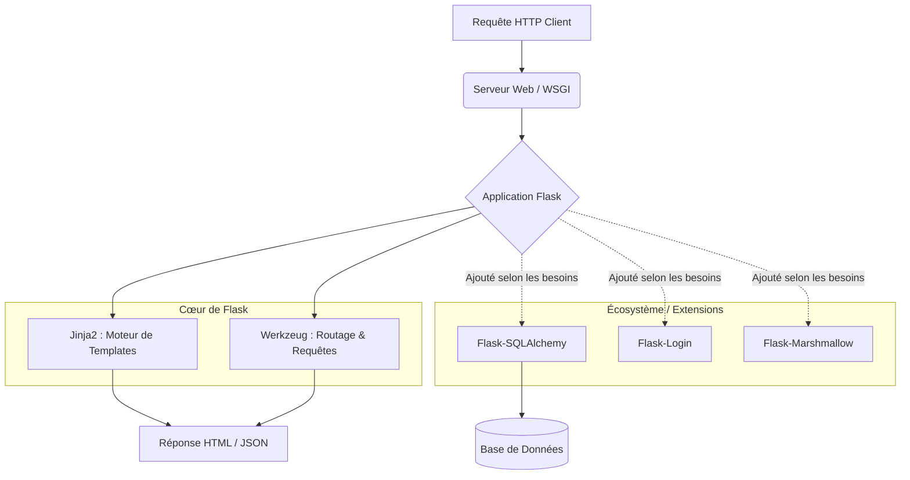

# 3-1-2-Présentation de Flask : micro-framework, principes et écosystème

Flask est un framework web pour Python créé en 2010 par Armin Ronacher. Il est conçu pour être léger, flexible et facile à prendre en main, ce qui en fait un outil de choix pour le développement d'API RESTful, de microservices et d'applications web de petite à moyenne envergure.

## 1. Le concept de "Micro-framework"

Le terme **micro-framework** ne signifie pas que Flask est limité à de petits projets ou qu'il manque de fonctionnalités. Il désigne plutôt sa philosophie de conception : **le cœur du framework est simple et extensible**.

Contrairement à des frameworks monolithiques (comme Django) qui imposent une structure stricte et intègrent nativement un ORM ou un système d'authentification, Flask ne prend aucune décision à votre place. Il fournit uniquement les outils indispensables pour recevoir des requêtes HTTP et renvoyer des réponses. C'est au développeur d'ajouter les composants supplémentaires (bases de données, validation, sécurité) selon les besoins spécifiques du projet.

## 2. Les principes fondateurs de Flask

Le cœur de Flask repose sur deux bibliothèques fondamentales développées par le projet Pallets :

*   **Werkzeug :** C'est une boîte à outils WSGI (Web Server Gateway Interface). Elle gère la communication entre le serveur web et l'application Python. Werkzeug s'occupe du routage des URL (associer une URL à une fonction Python), de la gestion des requêtes et des réponses HTTP.
*   **Jinja2 :** C'est un moteur de templates puissant. Il permet de générer des pages HTML dynamiques en insérant des variables et des structures de contrôle (boucles, conditions) directement dans le code HTML.

## 3. L'écosystème et les extensions

La véritable puissance de Flask réside dans son écosystème d'extensions. Puisque le cœur est minimaliste, la communauté a développé des centaines d'extensions officielles ou tierces qui s'intègrent de manière transparente à l'application.

Voici quelques extensions incontournables :
*   **Flask-SQLAlchemy :** Intégration de l'ORM SQLAlchemy pour interagir avec des bases de données SQL.
*   **Flask-Marshmallow :** Sérialisation et désérialisation des objets (très utile pour créer des API JSON).
*   **Flask-Login :** Gestion des sessions utilisateurs et de l'authentification.
*   **Flask-CORS :** Gestion du Cross-Origin Resource Sharing pour autoriser des applications front-end (React, Vue) à requêter l'API.

## 4. Architecture modulaire de Flask



## 5. Exemple : Une application Flask minimale

La simplicité de Flask permet de lancer un serveur web fonctionnel en quelques lignes de code.

```python
from flask import Flask, jsonify

# Initialisation de l'application
app = Flask(__name__)

# Définition d'une route avec le décorateur @app.route
@app.route('/api/statut', methods=['GET'])
def statut_api():
    # Flask convertit automatiquement les dictionnaires en JSON
    return jsonify({
        "statut": "succès",
        "message": "L'API d'inventaire réseau fonctionne correctement",
        "version": "1.0"
    }), 200

# Point d'entrée pour lancer le serveur de développement
if __name__ == '__main__':
    # debug=True permet le rechargement automatique à chaque modification du code
    app.run(host='127.0.0.1', port=5000, debug=True)
```

Dans cet exemple, Werkzeug gère l'association entre l'URL `/api/statut` et la fonction `statut_api()`. La fonction `jsonify` formate la réponse HTTP avec le bon type MIME (`application/json`).

---
**Sources utilisées :**
*   *Documentation officielle de Flask - Foreword (What does "micro" mean?)* (flask.palletsprojects.com/en/3.0.x/foreword/)
*   *Pallets Projects - Werkzeug and Jinja* (palletsprojects.com)
*   *Miguel Grinberg - The Flask Mega-Tutorial* (blog.miguelgrinberg.com)