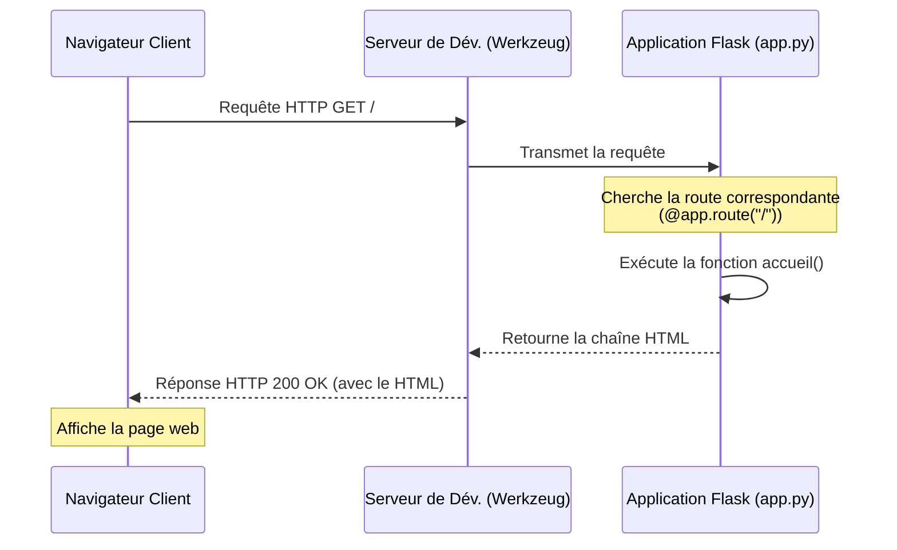

# 3-1-3-Installation de Flask et création de la première application

Pour démarrer avec Flask, il est recommandé d'utiliser un environnement virtuel. Cela permet d'isoler les dépendances de votre projet et d'éviter les conflits avec d'autres applications Python sur votre système. Actuellement, Flask (version 3.1.x) nécessite Python 3.9 ou une version ultérieure.

## 1. Préparation de l'environnement et installation

La création d'un environnement virtuel se fait à l'aide du module natif `venv` de Python.

**Étape 1 : Créer le dossier du projet et l'environnement virtuel**
Ouvrez votre terminal et exécutez les commandes suivantes :

```bash
# Création du dossier du projet
mkdir api_inventaire
cd api_inventaire

# Création de l'environnement virtuel nommé ".venv"
python -m venv .venv
```

**Étape 2 : Activer l'environnement virtuel**
L'activation diffère selon votre système d'exploitation :
*   **Windows :** `.venv\Scripts\activate`
*   **macOS / Linux :** `source .venv/bin/activate`

**Étape 3 : Installer Flask**
Une fois l'environnement activé (votre terminal affiche `(.venv)`), installez Flask via le gestionnaire de paquets `pip` :

```bash
pip install Flask
```

## 2. Création de la première application

Créez un fichier nommé `app.py` à la racine de votre dossier `api_inventaire`. Ce fichier contiendra le code minimal pour instancier et configurer votre serveur web.

**Fichier `app.py` :**
```python
from flask import Flask

# 1. Instanciation de l'application Flask
# __name__ permet à Flask de localiser les ressources (comme les templates)
app = Flask(__name__)

# 2. Définition d'une route
# Le décorateur @app.route associe l'URL "/" à la fonction qui suit
@app.route("/")
def accueil():
    return "<p>Bienvenue sur l'API d'inventaire réseau !</p>"

# 3. Point d'entrée (Optionnel si on utilise la commande 'flask run')
if __name__ == "__main__":
    # Lancement du serveur de développement
    app.run(debug=True)
```

## 3. Lancement du serveur de développement

Il existe deux méthodes principales pour démarrer votre application en phase de développement.

**Méthode 1 : Via la commande CLI de Flask (Recommandée)**
Flask intègre une interface en ligne de commande (CLI). Par défaut, elle cherche un fichier nommé `app.py` ou `wsgi.py`.

```bash
# Lancer le serveur avec le mode debug activé (rechargement automatique)
flask --app app run --debug
```

**Méthode 2 : Via l'interpréteur Python**
Si vous avez inclus le bloc `if __name__ == "__main__":` dans votre code, vous pouvez lancer le script directement :

```bash
python app.py
```

Dans les deux cas, le terminal affichera une adresse locale, généralement `http://127.0.0.1:5000/`. En ouvrant cette URL dans votre navigateur, vous verrez s'afficher le message de bienvenue.

## 4. Cycle de vie d'une requête Flask

Le diagramme suivant illustre ce qui se passe lorsque vous accédez à `http://127.0.0.1:5000/` dans votre navigateur :



---
**Sources utilisées :**
*   *Documentation officielle de Flask (3.1.x) - Installation* (flask.palletsprojects.com/en/stable/installation/)
*   *Documentation officielle de Flask (3.1.x) - Quickstart* (flask.palletsprojects.com/en/stable/quickstart/)