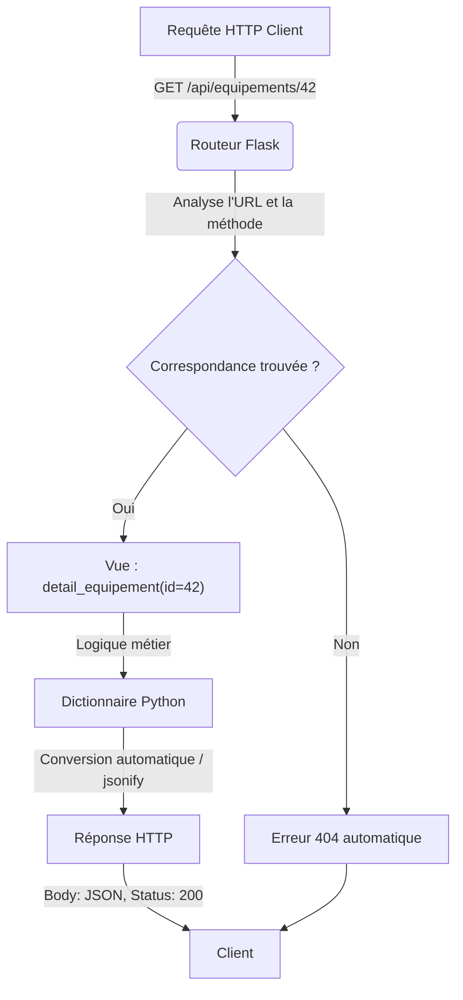

# 3-1-4-Routing, vues, réponses HTTP (JSON)

Dans Flask, la gestion des requêtes entrantes repose sur deux concepts intimement liés : le **routing** (routage) et les **vues** (views). L'objectif final de ces mécanismes est de générer une **réponse HTTP**, très souvent au format JSON dans le contexte d'une API.

## 1. Le Routing : Associer une URL à une action

Le routage est le mécanisme qui permet à Flask de savoir quel code exécuter lorsqu'un client (navigateur, application mobile, autre serveur) demande une URL spécifique. 

Flask utilise le décorateur `@app.route()` pour lier une URL à une fonction Python. Par défaut, une route ne répond qu'aux requêtes `GET`, mais il est possible de spécifier d'autres méthodes HTTP (`POST`, `PUT`, `DELETE`).

### Routage statique et dynamique
Les routes peuvent être fixes ou contenir des variables (routage dynamique). Les variables sont capturées dans l'URL et passées en tant qu'arguments à la vue.

```python
from flask import Flask

app = Flask(__name__)

# Route statique
@app.route('/api/equipements', methods=['GET'])
def liste_equipements():
    pass

# Route dynamique avec conversion de type (int:)
@app.route('/api/equipements/<int:id_equipement>', methods=['GET'])
def detail_equipement(id_equipement):
    # id_equipement sera un entier (ex: si URL = /api/equipements/42, id_equipement = 42)
    pass
```

## 2. Les Vues (Views) : Traiter la requête

La **vue** est simplement la fonction Python qui se trouve juste en dessous du décorateur `@app.route()`. Son rôle est de :
1. Récupérer les données de la requête (paramètres d'URL, corps de la requête).
2. Exécuter la logique métier (interroger une base de données, effectuer un calcul).
3. Retourner une réponse au client.

## 3. Les Réponses HTTP et le format JSON

Dans le cadre du développement d'une API REST, le format d'échange de données standard est le **JSON**. Flask simplifie grandement la création de réponses JSON.

### Retourner un dictionnaire directement
Depuis la version 1.1.0 de Flask, si une vue retourne un dictionnaire (`dict`) ou une liste (`list`), Flask le convertit automatiquement en une réponse JSON valide (avec l'en-tête `Content-Type: application/json`).

```python
@app.route('/api/equipements/1')
def obtenir_equipement():
    equipement = {
        "id": 1,
        "hostname": "srv-web-01",
        "ip": "192.168.1.10"
    }
    # Flask convertit automatiquement ce dictionnaire en JSON
    return equipement
```

### Utiliser `jsonify` et gérer les codes de statut HTTP
Pour renvoyer un code de statut HTTP spécifique (ex: `201 Created` ou `404 Not Found`), on peut retourner un tuple contenant les données et le code HTTP. 

La fonction `jsonify()` reste très utile si vous souhaitez sérialiser des structures de données plus complexes ou si vous préférez une syntaxe explicite.

```python
from flask import jsonify

@app.route('/api/equipements', methods=['POST'])
def creer_equipement():
    # Logique de création ici...
    nouvel_equipement = {"id": 2, "hostname": "sw-access-02"}
    
    # Retourne le JSON et le code HTTP 201 (Créé)
    return jsonify(nouvel_equipement), 201

@app.route('/api/equipements/999')
def equipement_introuvable():
    erreur = {"erreur": "Équipement non trouvé"}
    # Retourne le JSON et le code HTTP 404 (Non trouvé)
    return erreur, 404
```

## 4. Synthèse du flux de traitement



---
**Sources utilisées :**
*   *Documentation officielle Flask - Routing* (flask.palletsprojects.com/en/stable/quickstart/#routing)
*   *Documentation officielle Flask - About Responses* (flask.palletsprojects.com/en/stable/quickstart/#about-responses)
*   *Sentry - How Do I Return a JSON Response from a Flask View?* (sentry.io/answers/return-json-in-flask-view/)