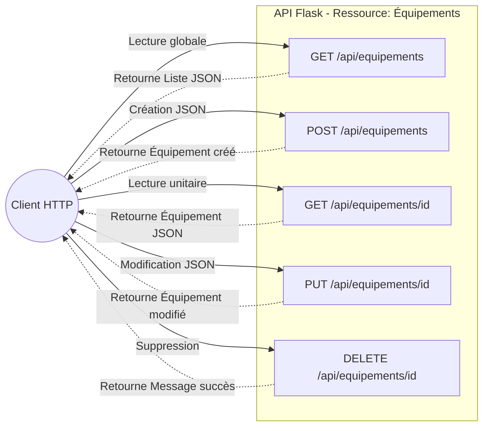

# 3-1-5-Création d'APIs web (GET, POST, PUT, DELETE) pour une ressource simple (ex: Équipements réseau)

Une API RESTful repose sur l'utilisation standardisée des méthodes HTTP pour manipuler des ressources. Dans ce cours, nous allons créer une API complète permettant de gérer un inventaire d'équipements réseau en utilisant les quatre opérations fondamentales (CRUD) :

*   **GET** : Lire (Read)
*   **POST** : Créer (Create)
*   **PUT** : Mettre à jour (Update)
*   **DELETE** : Supprimer (Delete)

Pour simplifier et nous concentrer sur la logique de l'API, nous utiliserons une liste Python en mémoire en guise de base de données.

## 1. Initialisation de l'application et des données

Commençons par configurer notre application Flask et définir notre source de données initiale.

```python
from flask import Flask, request, jsonify

app = Flask(__name__)

# Base de données simulée en mémoire
equipements = [
    {"id": 1, "hostname": "srv-web-01", "ip": "192.168.1.10", "actif": True},
    {"id": 2, "hostname": "sw-access-02", "ip": "192.168.1.2", "actif": True}
]
```

## 2. Implémentation des endpoints (Routes)

### A. GET : Récupérer des ressources (Read)

Nous avons besoin de deux routes GET : l'une pour récupérer tous les équipements, l'autre pour récupérer un équipement spécifique via son identifiant.

```python
# Récupérer tous les équipements
@app.route('/api/equipements', methods=['GET'])
def get_equipements():
    return jsonify({"equipements": equipements}), 200

# Récupérer un équipement par son ID
@app.route('/api/equipements/<int:equipement_id>', methods=['GET'])
def get_equipement(equipement_id):
    equipement = next((e for e in equipements if e["id"] == equipement_id), None)
    if equipement is None:
        return jsonify({"erreur": "Équipement non trouvé"}), 404
    return jsonify(equipement), 200
```

### B. POST : Créer une nouvelle ressource (Create)

La méthode POST est utilisée pour envoyer de nouvelles données au serveur. Les données sont généralement transmises dans le corps (body) de la requête au format JSON.

```python
@app.route('/api/equipements', methods=['POST'])
def create_equipement():
    # Récupération des données JSON envoyées par le client
    donnees = request.get_json()
    
    if not donnees or not 'hostname' in donnees:
        return jsonify({"erreur": "Le hostname est obligatoire"}), 400
        
    nouvel_equipement = {
        # Génération d'un nouvel ID (ID max + 1)
        "id": max(e['id'] for e in equipements) + 1 if equipements else 1,
        "hostname": donnees['hostname'],
        "ip": donnees.get('ip', ""),
        "actif": True
    }
    
    equipements.append(nouvel_equipement)
    return jsonify(nouvel_equipement), 201 # 201 = Created
```

### C. PUT : Mettre à jour une ressource existante (Update)

La méthode PUT remplace ou met à jour une ressource existante. L'ID de la ressource à modifier est passé dans l'URL.

```python
@app.route('/api/equipements/<int:equipement_id>', methods=['PUT'])
def update_equipement(equipement_id):
    equipement = next((e for e in equipements if e["id"] == equipement_id), None)
    if equipement is None:
        return jsonify({"erreur": "Équipement non trouvé"}), 404
        
    donnees = request.get_json()
    
    # Mise à jour des champs si fournis
    if 'hostname' in donnees:
        equipement['hostname'] = donnees['hostname']
    if 'ip' in donnees:
        equipement['ip'] = donnees['ip']
    if 'actif' in donnees:
        equipement['actif'] = donnees['actif']
        
    return jsonify(equipement), 200
```

### D. DELETE : Supprimer une ressource (Delete)

La méthode DELETE supprime la ressource identifiée dans l'URL.

```python
@app.route('/api/equipements/<int:equipement_id>', methods=['DELETE'])
def delete_equipement(equipement_id):
    global equipements
    equipement = next((e for e in equipements if e["id"] == equipement_id), None)
    if equipement is None:
        return jsonify({"erreur": "Équipement non trouvé"}), 404
        
    # Filtrer la liste pour exclure l'équipement à supprimer
    equipements = [e for e in equipements if e["id"] != equipement_id]
    return jsonify({"message": "Équipement supprimé avec succès"}), 200

if __name__ == '__main__':
    app.run(debug=True)
```

## 3. Synthèse des opérations CRUD

Le tableau et le diagramme ci-dessous résument l'architecture de notre API REST.

| Opération CRUD | Méthode HTTP | Endpoint (URL) | Action | Code HTTP Succès |
| :--- | :--- | :--- | :--- | :--- |
| **C**reate | `POST` | `/api/equipements` | Enregistre un nouvel équipement | `201 Created` |
| **R**ead | `GET` | `/api/equipements` | Liste tous les équipements | `200 OK` |
| **R**ead | `GET` | `/api/equipements/<id>` | Affiche un équipement spécifique | `200 OK` |
| **U**pdate | `PUT` | `/api/equipements/<id>` | Modifie un équipement existant | `200 OK` |
| **D**elete | `DELETE` | `/api/equipements/<id>` | Supprime un équipement | `200 OK` |



---
**Sources utilisées :**
*   *UI Bakery - Flask CRUD operations* (uibakery.io/crud-operations/flask)
*   *Dev.to - Python CRUD Rest API using Flask* (dev.to/francescoxx/build-a-crud-rest-api-in-python-using-flask-sqlalchemy-postgres-docker-28lo)
*   *Documentation officielle Flask - request object* (flask.palletsprojects.com/en/stable/api/#flask.request)