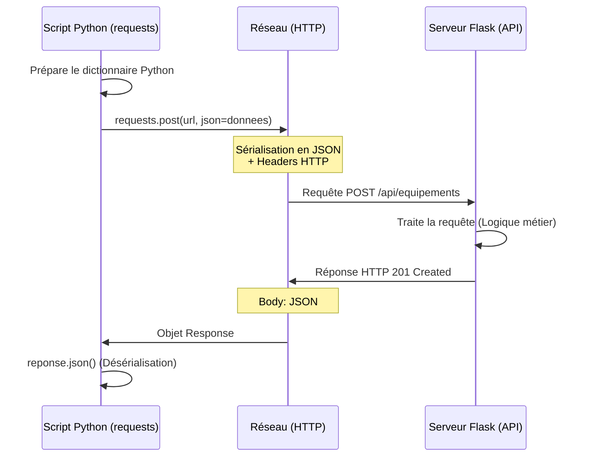

# 3-1-6-Consommation de l'API Flask avec un script Python client (`requests`)

Une fois qu'une API est créée (comme notre API de gestion d'équipements développée précédemment), elle a vocation à être utilisée par des clients. Un client peut être une application web (React, Vue), une application mobile, ou un autre script serveur (par exemple un script de supervision qui interroge périodiquement l'inventaire). 

En Python, la bibliothèque standard de facto pour interagir avec des API REST est **`requests`**. Elle masque la complexité des requêtes HTTP derrière une syntaxe simple et élégante.

## 1. Installation de la bibliothèque `requests`

La bibliothèque `requests` n'est pas incluse dans la bibliothèque standard de Python. Il faut l'installer via `pip` dans votre environnement virtuel :

```bash
pip install requests
```

## 2. Consommer l'API : Exemples pratiques (CRUD)

Pour ces exemples, nous partons du principe que l'API Flask d'inventaire développée dans le chapitre précédent tourne localement sur `http://127.0.0.1:5000`.

### A. GET : Lire des données

La méthode `requests.get()` permet de récupérer des données. La méthode `.json()` de l'objet réponse convertit automatiquement le corps de la réponse JSON en dictionnaire Python.

```python
import requests

BASE_URL = "http://127.0.0.1:5000/api/equipements"

# 1. Récupérer tous les équipements
reponse = requests.get(BASE_URL)

if reponse.status_code == 200:
    donnees = reponse.json()
    print("Liste des équipements :", donnees)
else:
    print("Erreur lors de la récupération :", reponse.status_code)

# 2. Récupérer un équipement spécifique (ex: ID 1)
reponse_equipement = requests.get(f"{BASE_URL}/1")
print("Équipement 1 :", reponse_equipement.json())
```

### B. POST : Envoyer des données (Création)

Pour créer une ressource, on utilise `requests.post()`. On passe les données à envoyer via l'argument `json=`. La bibliothèque se charge de formater les données en JSON et d'ajouter l'en-tête `Content-Type: application/json`.

```python
import requests

BASE_URL = "http://127.0.0.1:5000/api/equipements"

nouvel_equipement = {
    "hostname": "srv-dns-01",
    "ip": "192.168.1.20"
}

reponse = requests.post(BASE_URL, json=nouvel_equipement)

if reponse.status_code == 201:
    print("Équipement créé avec succès :", reponse.json())
else:
    print("Échec de la création :", reponse.text)
```

### C. PUT : Mettre à jour des données

La méthode `requests.put()` fonctionne de la même manière que `post()`, mais elle cible l'URL spécifique de la ressource à modifier.

```python
import requests

# On cible l'équipement avec l'ID 1
URL_EQUIPEMENT_1 = "http://127.0.0.1:5000/api/equipements/1"

mise_a_jour = {
    "actif": False
}

reponse = requests.put(URL_EQUIPEMENT_1, json=mise_a_jour)

if reponse.status_code == 200:
    print("Équipement mis à jour :", reponse.json())
```

### D. DELETE : Supprimer des données

Pour supprimer une ressource, on utilise `requests.delete()`. Généralement, cette requête ne nécessite pas de corps (body).

```python
import requests

URL_EQUIPEMENT_1 = "http://127.0.0.1:5000/api/equipements/1"

reponse = requests.delete(URL_EQUIPEMENT_1)

if reponse.status_code == 200:
    print("Succès :", reponse.json())
elif reponse.status_code == 404:
    print("Erreur : L'équipement n'existe pas.")
```

## 3. Bonnes pratiques : Gestion des erreurs

Lorsqu'on consomme une API, le réseau peut faillir ou le serveur peut renvoyer une erreur (404, 500). Il est recommandé d'utiliser la méthode `raise_for_status()` qui déclenche une exception Python si le code HTTP indique une erreur (code >= 400).

```python
import requests
from requests.exceptions import HTTPError, ConnectionError

try:
    reponse = requests.get("http://127.0.0.1:5000/api/equipements")
    # Déclenche une exception si le statut est 4xx ou 5xx
    reponse.raise_for_status() 
    
    equipements = reponse.json()
    print(equipements)
    
except HTTPError as http_err:
    print(f"Erreur HTTP : {http_err}")
except ConnectionError:
    print("Erreur de connexion : Le serveur Flask est-il lancé ?")
except Exception as err:
    print(f"Une erreur inattendue est survenue : {err}")
```

## 4. Architecture de l'interaction Client-Serveur



---
**Sources utilisées :**
*   *Real Python - Python and REST APIs: Interacting With Web Services* (realpython.com/api-integration-in-python)
*   *DataCamp - Getting Started with Python HTTP Requests for REST APIs* (datacamp.com/tutorial/making-http-requests-in-python)
*   *Documentation officielle Requests* (requests.readthedocs.io)