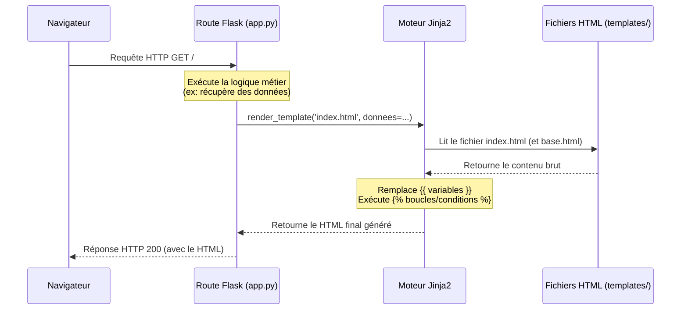

# 3-2-1-Utilisation de Jinja2 pour les templates HTML

Dans une application web, il est primordial de séparer la logique métier (le code Python) de la présentation (le code HTML). C'est ici qu'interviennent les moteurs de templates. Flask intègre par défaut **Jinja2**, un moteur de templates puissant et rapide.

Jinja2 permet de générer des pages HTML dynamiques en injectant des données provenant de votre code Python directement dans vos fichiers HTML, tout en offrant des structures de contrôle (boucles, conditions) et un système d'héritage.

## 1. La fonction `render_template`

Pour utiliser un template, Flask fournit la fonction `render_template()`. Par convention, Flask recherche toujours les fichiers HTML dans un dossier nommé `templates` situé à la racine de votre projet.

**Structure du projet :**
```text
api_inventaire/
│
├── app.py
└── templates/
    └── index.html
```

**Fichier `app.py` :**
```python
from flask import Flask, render_template

app = Flask(__name__)

@app.route('/')
def accueil():
    # On passe une variable 'nom_utilisateur' au template
    return render_template('index.html', nom_utilisateur="admin_noc")
```

## 2. Syntaxe de base de Jinja2

Jinja2 utilise des délimiteurs spécifiques dans le code HTML pour se différencier du texte statique.

### A. Afficher des variables : `{{ ... }}`
Les doubles accolades permettent d'évaluer une expression Python et d'afficher son résultat. Flask active par défaut l'*autoescaping* (échappement automatique) pour prévenir les failles XSS (Cross-Site Scripting).

**Fichier `templates/index.html` :**
```html
<h1>Bienvenue, {{ nom_utilisateur }} !</h1>
```

### B. Structures de contrôle : ``
Les balises contenant des pourcentages sont utilisées pour la logique (conditions, boucles).

**Exemple avec une condition (`if`) et une boucle (`for`) :**
```html
<!-- Condition -->

    <p>Vous avez les droits d'administration.</p>

    <p>Vous êtes un utilisateur standard.</p>


<!-- Boucle -->
<h2>Vos équipements :</h2>
<ul>

    <li>{{ equipement.hostname }} - ActifInactif</li>

</ul>
```

## 3. L'héritage de templates (Template Inheritance)

L'une des fonctionnalités les plus puissantes de Jinja2 est l'héritage. Il permet de créer un "squelette" de base (contenant le header, le footer, les menus) que toutes les autres pages vont réutiliser, évitant ainsi la duplication de code.

**1. Le template de base (`templates/base.html`) :**
On définit des blocs (``) qui pourront être redéfinis par les templates enfants.

```html
<!DOCTYPE html>
<html lang="fr">
<head>
    <meta charset="UTF-8">
    <title>Inventaire Réseau</title>
</head>
<body>
    <header>
        <nav>Menu de navigation commun</nav>
    </header>

    <main>
        <!-- C'est ici que le contenu spécifique de chaque page sera injecté -->
        
    </main>

    <footer>Pied de page commun</footer>
</body>
</html>
```

**2. Le template enfant (`templates/accueil.html`) :**
Il "étend" le template de base et remplit les blocs définis.

```html


Accueil - Inventaire Réseau


    <h1>Bienvenue sur le tableau de bord d'inventaire</h1>
    <p>Ceci est le contenu spécifique à l'accueil.</p>

```

## 4. Flux de rendu d'un template

Le diagramme suivant illustre comment Flask et Jinja2 collaborent pour renvoyer une page web au client.



---
**Sources utilisées :**
*   *Documentation officielle Flask (3.1.x) - Templates* (flask.palletsprojects.com/en/stable/templating/)
*   *Documentation officielle Jinja2* (jinja.palletsprojects.com)
*   *GeeksforGeeks - Templating With Jinja2 in Flask* (geeksforgeeks.org/python/templating-with-jinja2-in-flask)