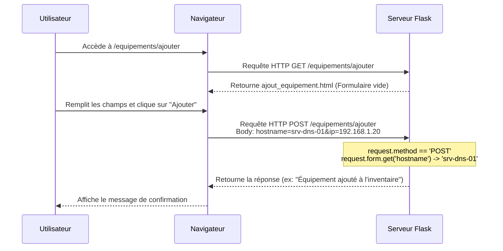

# 3-2-3-Formulaires HTML et traitement des entrées utilisateur (GET/POST, `request` object)

L'interaction avec l'utilisateur est au cœur des applications web. Les formulaires HTML sont le moyen standard de collecter des données (texte, fichiers, sélections) pour les envoyer au serveur. Dans Flask, la réception et le traitement de ces données s'effectuent via l'objet `request`.

## 1. Les méthodes HTTP : GET vs POST

Lorsqu'un formulaire est soumis, le navigateur envoie une requête HTTP au serveur. Le choix de la méthode HTTP détermine la façon dont les données sont transmises :

*   **GET** : Les données du formulaire sont ajoutées directement dans l'URL (ex: `/recherche?q=flask`). Cette méthode est utilisée pour **récupérer** des informations. Elle ne doit jamais être utilisée pour envoyer des données sensibles (mots de passe) ou pour modifier l'état du serveur.
*   **POST** : Les données sont incluses dans le corps (body) de la requête HTTP, de manière invisible dans l'URL. Cette méthode est utilisée pour **envoyer** des données destinées à être traitées (création de compte, paiement, soumission d'un article).

## 2. L'objet `request` dans Flask

Flask fournit un objet global nommé `request` qui contient toutes les informations relatives à la requête HTTP entrante. 

Pour accéder aux données d'un formulaire, on utilise deux attributs principaux de cet objet, selon la méthode HTTP employée :

*   `request.args` : Un dictionnaire contenant les paramètres passés dans l'URL (méthode GET).
*   `request.form` : Un dictionnaire contenant les données soumises via un formulaire HTML (méthode POST).

## 3. Implémentation pratique : Un formulaire d'ajout d'équipement

Voici comment créer et traiter un formulaire d'ajout d'équipement simple.

### A. Le template HTML (`templates/ajout_equipement.html`)

Le formulaire doit spécifier la méthode (`method="POST"`) et l'URL de destination (`action="/equipements/ajouter"`). Chaque champ de saisie doit posséder un attribut `name`, qui servira de clé pour récupérer la valeur côté serveur.

```html
<!DOCTYPE html>
<html lang="fr">
<head>
    <meta charset="UTF-8">
    <title>Ajouter un équipement</title>
</head>
<body>
    <h1>Ajouter un équipement</h1>
    
    <!-- Le formulaire envoie les données en POST vers la route /equipements/ajouter -->
    <form action="/equipements/ajouter" method="POST">
        <div>
            <label for="hostname">Hostname :</label>
            <input type="text" id="hostname" name="hostname" required>
        </div>
        
        <div>
            <label for="ip">Adresse IP :</label>
            <input type="text" id="ip" name="ip" required>
        </div>
        
        <button type="submit">Ajouter</button>
    </form>
</body>
</html>
```

### B. La route Flask (`app.py`)

Par défaut, une route Flask n'accepte que les requêtes GET. Pour autoriser la soumission du formulaire, il faut explicitement ajouter `POST` dans la liste des méthodes autorisées via le décorateur `@app.route`.

```python
from flask import Flask, render_template, request

app = Flask(__name__)

@app.route('/equipements/ajouter', methods=['GET', 'POST'])
def ajouter_equipement():
    # Si la méthode est POST, le formulaire a été soumis
    if request.method == 'POST':
        # Récupération des données via l'attribut 'name' des inputs HTML
        hostname = request.form.get('hostname')
        ip = request.form.get('ip')
        
        # Traitement des données (ex: sauvegarde en base de données)
        # ...
        
        return f"L'équipement {hostname} ({ip}) a été ajouté à l'inventaire."
    
    # Si la méthode est GET, on affiche simplement le formulaire vide
    return render_template('ajout_equipement.html')

if __name__ == '__main__':
    app.run(debug=True)
```

*Note : L'utilisation de `request.form.get('cle')` est préférable à `request.form['cle']` car elle renvoie `None` si la clé n'existe pas, évitant ainsi une erreur `KeyError` qui ferait planter l'application.*

## 4. Flux de traitement d'un formulaire

Le diagramme suivant illustre le cycle complet, de l'affichage du formulaire à son traitement.



---
**Sources utilisées :**
*   *Documentation officielle Flask (3.1.x) - The Request Object* (flask.palletsprojects.com/en/stable/quickstart/#the-request-object)
*   *Documentation officielle Flask (3.1.x) - HTTP Methods* (flask.palletsprojects.com/en/stable/quickstart/#http-methods)
*   *GeeksforGeeks - Python Flask Request Object* (geeksforgeeks.org/python/python-flask-request-object)
*   *DataFlair - Flask Request Object* (data-flair.training/blogs/flask-request-object)