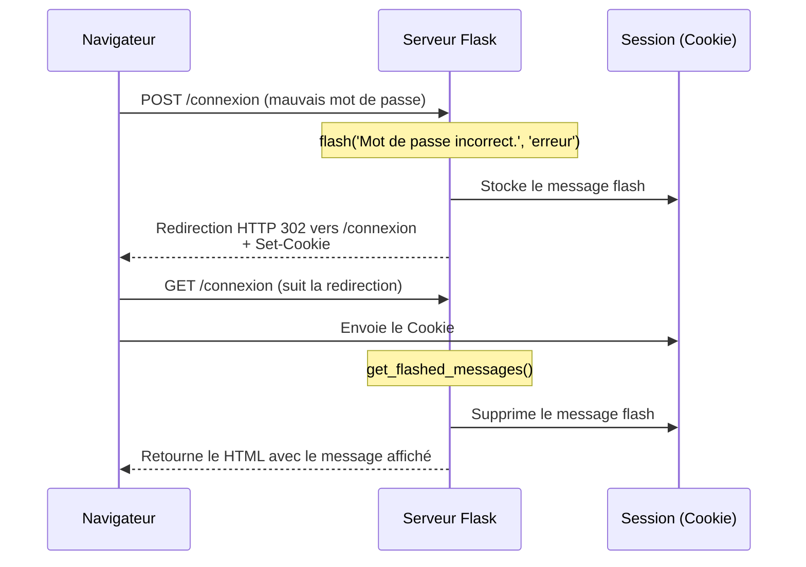

# 3-2-4-Gestion des sessions et des messages flash

Le protocole HTTP est par nature "sans état" (stateless) : chaque requête est indépendante et le serveur ne conserve aucune mémoire des requêtes précédentes. Pour pallier cela et maintenir un contexte utilisateur (comme le fait d'être connecté), les applications web utilisent des **sessions**. Flask propose également un mécanisme dérivé des sessions appelé **messages flash**, permettant d'afficher des notifications temporaires.

## 1. Les Sessions dans Flask

Une session permet de stocker des informations spécifiques à un utilisateur d'une requête à l'autre. Dans Flask, les données de session sont stockées côté client dans un cookie cryptographiquement signé. Cela signifie que l'utilisateur peut voir le contenu du cookie, mais ne peut pas le modifier sans invalider la signature.

### A. Configuration de la clé secrète

Pour signer les cookies de session, Flask exige la définition d'une clé secrète (`SECRET_KEY`). Sans cette clé, l'utilisation des sessions provoquera une erreur.

```python
from flask import Flask, session

app = Flask(__name__)
# Clé secrète pour signer les cookies (à garder secrète en production !)
app.secret_key = 'une_cle_tres_secrete_et_complexe'
```

### B. Utilisation de l'objet `session`

L'objet `session` s'utilise comme un dictionnaire Python classique.

```python
from flask import Flask, session, redirect, url_for, request

app = Flask(__name__)
app.secret_key = 'super_secret'

@app.route('/login', methods=['POST'])
def login():
    utilisateur = request.form.get('username')
    # Stockage de l'utilisateur dans la session
    session['utilisateur_connecte'] = utilisateur
    return redirect(url_for('profil'))

@app.route('/profil')
def profil():
    # Récupération de la donnée en session
    if 'utilisateur_connecte' in session:
        return f"Bienvenue, {session['utilisateur_connecte']} !"
    return "Vous n'êtes pas connecté."

@app.route('/logout')
def logout():
    # Suppression de la donnée de la session
    session.pop('utilisateur_connecte', None)
    return "Vous avez été déconnecté."
```

## 2. Les Messages Flash

Les messages flash sont utilisés pour fournir un retour d'information à l'utilisateur après une action (ex: "Mot de passe incorrect", "Équipement ajouté à l'inventaire"). 

Le principe est simple : on enregistre un message à la fin d'une requête, et on l'affiche lors de la requête suivante (généralement après une redirection). Une fois affiché, le message est automatiquement supprimé de la session.

### A. Créer un message flash (Côté Python)

La fonction `flash()` permet d'enregistrer un message. Il est possible de lui associer une catégorie (ex: 'succes', 'erreur', 'info') pour adapter le style d'affichage.

```python
from flask import Flask, flash, redirect, render_template, request

app = Flask(__name__)
app.secret_key = 'super_secret'

@app.route('/connexion', methods=['GET', 'POST'])
def connexion():
    if request.method == 'POST':
        mot_de_passe = request.form.get('password')
        
        if mot_de_passe == '1234':
            flash('Connexion à la console de supervision réussie !', 'succes')
            return redirect('/dashboard')
        else:
            flash('Mot de passe incorrect.', 'erreur')
            
    return render_template('connexion.html')
```

### B. Afficher les messages flash (Côté Template Jinja2)

Dans le template HTML (souvent dans le fichier `base.html` pour qu'il soit disponible sur toutes les pages), on utilise la fonction `get_flashed_messages()` pour récupérer et afficher les messages. L'argument `with_categories=true` permet de récupérer également la catégorie associée.

```html
<!-- templates/base.html -->
<!DOCTYPE html>
<html>
<head>
    <title>Mon Application</title>
</head>
<body>
    <!-- Zone d'affichage des messages flash -->
    
        
            <ul class="flashes">
            
                <!-- La catégorie peut être utilisée comme classe CSS -->
                <li class="{{ categorie }}">{{ message }}</li>
            
            </ul>
        
    

    <main>
        
    </main>
</body>
</html>
```

## 3. Cycle de vie d'un message flash

Le diagramme suivant montre comment un message flash transite via la session entre deux requêtes HTTP.



---
**Sources utilisées :**
*   *Documentation officielle Flask (3.1.x) - Message Flashing* (flask.palletsprojects.com/en/stable/patterns/flashing)
*   *Documentation officielle Flask (3.1.x) - Sessions* (flask.palletsprojects.com/en/stable/quickstart/#sessions)
*   *PythonGeeks - Flask Flashing* (pythongeeks.org/flask-flashing)