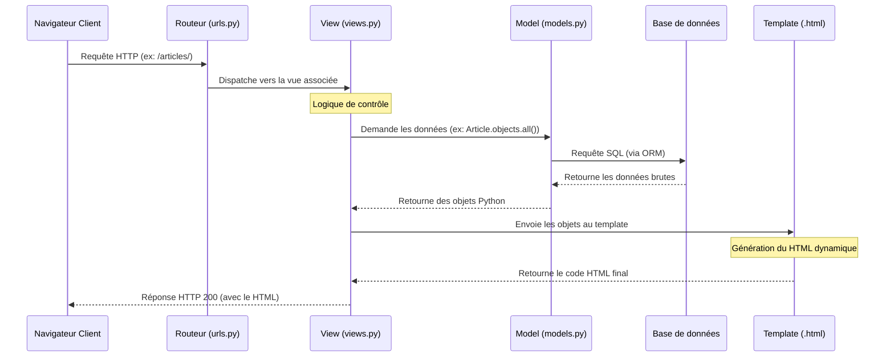

# 4-1-1-Présentation de Django : full-stack framework, philosophie DRY, MTV (Model-Template-View)

Django est un framework web open-source écrit en Python. Créé en 2003 pour répondre aux besoins de développement rapide des sites d'actualités, il est conçu pour aider les développeurs à concevoir des applications web complexes et robustes le plus rapidement possible.

## 1. Un framework "Full-Stack" (Batteries included)

Contrairement à des micro-frameworks comme Flask qui nécessitent l'ajout de nombreuses bibliothèques externes pour des fonctionnalités avancées, Django est qualifié de framework "full-stack" ou "batteries included" (piles incluses). 

Cela signifie qu'il fournit nativement tous les outils nécessaires pour construire une application web complète :
*   Un ORM (Object-Relational Mapper) pour interagir avec la base de données sans écrire de SQL.
*   Un système d'authentification et de gestion des utilisateurs sécurisé.
*   Une interface d'administration générée automatiquement.
*   Un moteur de templates puissant.
*   Des outils de protection contre les failles de sécurité courantes (CSRF, XSS, Clickjacking).

## 2. La philosophie DRY (Don't Repeat Yourself)

L'un des principes fondateurs de Django est le **DRY** (*Ne vous répétez pas*). L'objectif est de réduire la duplication de code au strict minimum. 

Chaque élément de connaissance ou de logique métier doit avoir une représentation unique et non ambiguë dans le système.

**Exemple d'application du DRY dans Django :**
Lorsque vous définissez un modèle de données (une table dans la base de données), Django utilise cette unique définition pour :
1.  Créer la table dans la base de données.
2.  Générer l'interface d'administration pour gérer ces données.
3.  Créer des formulaires HTML de saisie et de validation.

Si vous ajoutez un champ à votre modèle, toutes les autres couches (base de données, admin, formulaires) peuvent être mises à jour automatiquement sans avoir à réécrire le code à plusieurs endroits.

## 3. L'architecture MTV (Model-Template-View)

La plupart des frameworks web utilisent le motif d'architecture MVC (Modèle-Vue-Contrôleur). Django utilise une variante de ce motif appelée **MTV (Model-Template-View)**. La séparation des responsabilités est la même, mais la terminologie diffère.

### A. Model (Modèle)
Le Modèle représente la structure des données et la logique métier. Il définit les champs et les comportements des données stockées. Django traduit ces classes Python en tables de base de données via son ORM.

### B. Template (Gabarit)
Le Template correspond à la couche de présentation (ce qui s'affiche dans le navigateur). Il s'agit de fichiers HTML contenant une syntaxe spécifique (proche de Jinja2) permettant d'injecter des données dynamiques. *Dans le modèle MVC classique, cela correspond à la Vue.*

### C. View (Vue)
La Vue est le cœur de la logique de l'application. C'est une fonction ou une classe Python qui reçoit une requête HTTP, interagit avec le Modèle pour récupérer ou modifier des données, et renvoie une réponse HTTP (généralement en chargeant un Template). *Dans le modèle MVC classique, cela correspond au Contrôleur.*

## 4. Flux de traitement d'une requête (Architecture MTV)

Le diagramme suivant illustre comment les composants de l'architecture MTV interagissent lorsqu'un utilisateur demande une page web.

---
**Sources utilisées :**
*   *Documentation officielle Django (5.x) - Design philosophies* (docs.djangoproject.com/en/stable/misc/design-philosophies/)
*   *Documentation officielle Django (5.x) - FAQ: General* (docs.djangoproject.com/en/stable/faq/general/#django-appears-to-be-a-mvc-framework-but-you-call-the-controller-the-view-and-the-view-the-template-how-come-you-don-t-use-standard-names)
*   *Mozilla Developer Network (MDN) - Introduction à Django* (developer.mozilla.org/fr/docs/Learn/Server-side/Django/Introduction)