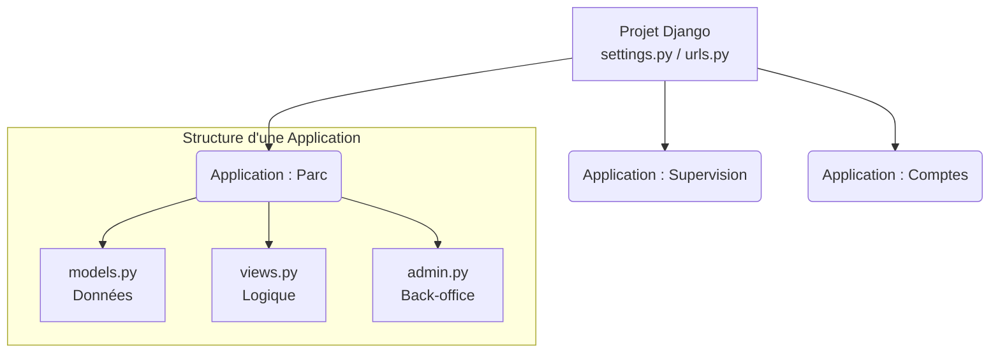

# 4-1-2-Installation de Django, création d'un projet et d'une application

Pour démarrer avec Django, il est nécessaire de mettre en place un environnement de travail propre. Django distingue deux concepts fondamentaux : le **Projet** (la configuration globale) et l'**Application** (un module fonctionnel spécifique).

## 1. Installation de Django

Il est fortement recommandé d'installer Django au sein d'un environnement virtuel Python (`venv`). Cela permet d'isoler les dépendances de votre projet et d'éviter les conflits avec d'autres projets sur votre machine.

**Étape 1 : Création et activation de l'environnement virtuel**
```bash
# Création de l'environnement virtuel nommé "env"
python -m venv env

# Activation (sur Windows)
env\Scripts\activate
# Activation (sur macOS / Linux)
source env/bin/activate
```

**Étape 2 : Installation du framework**
Une fois l'environnement activé, utilisez le gestionnaire de paquets `pip` pour installer la dernière version de Django (actuellement la branche 6.0.x).

```bash
pip install django
```

Pour vérifier que l'installation a réussi, vous pouvez afficher la version installée :
```bash
python -m django --version
```

## 2. Création d'un Projet Django

Un **Projet** Django est le conteneur principal de votre site web. Il regroupe la configuration globale (base de données, paramètres de sécurité, routage principal).

Pour générer la structure de base d'un projet, utilisez l'utilitaire en ligne de commande `django-admin` :

```bash
django-admin startproject gestion_parc
```

Cette commande génère l'arborescence suivante :
```text
gestion_parc/
├── manage.py          # Script utilitaire pour interagir avec le projet (serveur, base de données...)
└── gestion_parc/      # Le répertoire de configuration du projet
    ├── __init__.py
    ├── settings.py    # Fichier central de configuration (apps, BDD, langues...)
    ├── urls.py        # Définition des routes (URL) principales du site
    ├── asgi.py        # Point d'entrée pour les serveurs web asynchrones
    └── wsgi.py        # Point d'entrée pour les serveurs web synchrones (déploiement classique)
```

Vous pouvez dès à présent lancer le serveur de développement intégré pour vérifier que tout fonctionne :
```bash
cd gestion_parc
python manage.py runserver
```
*Le site sera accessible à l'adresse `http://127.0.0.1:8000/`.*

## 3. Création d'une Application Django

Dans la philosophie Django, un projet est composé de plusieurs **Applications**. Une application est un composant web qui fait quelque chose de précis (ex: un inventaire de parc, un module de supervision, un module d'authentification). 

*Règle d'or : Une application doit être la plus indépendante possible afin de pouvoir être réutilisée dans un autre projet.*

Pour créer une application, placez-vous dans le dossier contenant `manage.py` et exécutez :

```bash
python manage.py startapp parc
```

Cela crée un nouveau dossier `parc/` avec la structure suivante :
```text
parc/
├── __init__.py
├── admin.py       # Configuration de l'interface d'administration pour cette app
├── apps.py        # Configuration spécifique de l'application
├── models.py      # Définition des tables de la base de données (Architecture MTV)
├── tests.py       # Fichiers pour écrire des tests unitaires
└── views.py       # Logique métier et contrôleurs (Architecture MTV)
```

**Étape cruciale : Déclarer l'application**
Pour que Django prenne en compte cette nouvelle application (notamment pour la base de données), vous devez l'ajouter à la liste `INSTALLED_APPS` dans le fichier `gestion_parc/settings.py` :

```python
# gestion_parc/settings.py

INSTALLED_APPS = [
    'django.contrib.admin',
    'django.contrib.auth',
    'django.contrib.contenttypes',
    'django.contrib.sessions',
    'django.contrib.messages',
    'django.contrib.staticfiles',
    # Ajout de notre nouvelle application
    'parc', 
]
```

## 4. Relation entre Projet et Applications

Le diagramme ci-dessous illustre la manière dont un projet centralise et orchestre plusieurs applications indépendantes.



---
**Sources utilisées :**
*   *Documentation officielle Django (6.0.x) - Quick install guide* (docs.djangoproject.com/en/stable/intro/install/)
*   *Documentation officielle Django (6.0.x) - Writing your first Django app, part 1* (docs.djangoproject.com/en/stable/intro/tutorial01/)