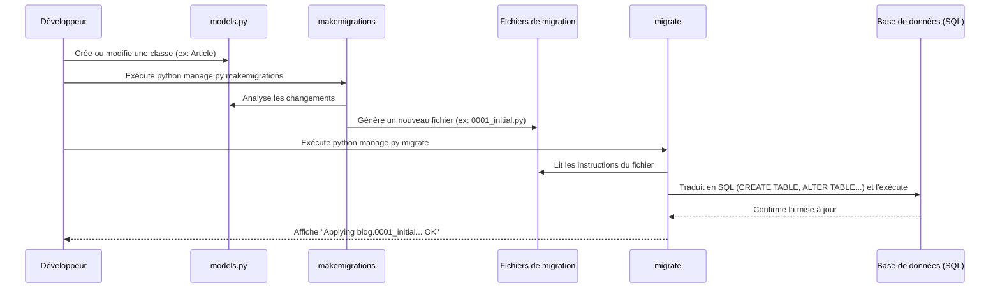

# 4-1-3-Modèles Django (ORM), migrations

Dans Django, la gestion des données repose sur deux concepts fondamentaux : l'**ORM** (Object-Relational Mapping) et les **migrations**. Ces outils permettent de manipuler la base de données en utilisant uniquement du code Python, sans avoir à écrire de requêtes SQL manuellement.

## 1. L'ORM de Django (Object-Relational Mapping)

Un ORM est une technique de programmation qui crée une interface entre le code orienté objet (Python) et une base de données relationnelle (SQL). 

**Les avantages de l'ORM Django :**
*   **Abstraction de la base de données :** Vous pouvez changer de système de base de données (passer de SQLite en développement à PostgreSQL en production) sans modifier votre code Python. L'ORM se charge de traduire le code dans le dialecte SQL approprié.
*   **Sécurité :** L'ORM protège nativement l'application contre les attaques par injection SQL en "nettoyant" automatiquement les données entrantes.
*   **Productivité :** La manipulation des données se fait via des objets et des méthodes Python intuitives.

## 2. Définir un Modèle

Dans l'architecture MTV de Django, le **Modèle** est la source unique et définitive d'informations sur vos données. Il contient les champs et les comportements essentiels des données que vous stockez. 

Chaque modèle est une classe Python qui hérite de `django.db.models.Model`. Chaque attribut de la classe représente un champ (une colonne) dans la base de données.

**Exemple : Création d'un modèle pour un article de blog (`blog/models.py`)**

```python
from django.db import models

class Article(models.Model):
    # Un champ texte court avec une limite de caractères (ex: VARCHAR)
    titre = models.CharField(max_length=200)
    
    # Un champ texte long sans limite (ex: TEXT)
    contenu = models.TextField()
    
    # Un champ date/heure rempli automatiquement à la création
    date_publication = models.DateTimeField(auto_now_add=True)
    
    # Un champ booléen avec une valeur par défaut
    est_publie = models.BooleanField(default=False)

    # Méthode pour définir comment l'objet s'affiche (utile dans l'interface d'administration)
    def __str__(self):
        return self.titre
```

## 3. Les Migrations : Le contrôle de version de la base de données

Une fois le modèle défini en Python, la table correspondante n'existe pas encore dans la base de données. C'est ici qu'interviennent les **migrations**.

Les migrations sont le moyen utilisé par Django pour propager les modifications apportées à vos modèles (ajout d'un champ, suppression d'un modèle, etc.) dans le schéma de votre base de données. Considérez les migrations comme un **système de contrôle de version (comme Git) pour votre base de données**.

Le processus s'effectue en deux étapes via le terminal :

### Étape 1 : `makemigrations`
Cette commande inspecte vos modèles, détecte les changements par rapport à l'état précédent, et génère un fichier de migration (un script Python contenant les instructions de mise à jour).

```bash
python manage.py makemigrations
```
*Résultat : Création d'un fichier comme `blog/migrations/0001_initial.py`.*

### Étape 2 : `migrate`
Cette commande lit les fichiers de migration non appliqués et exécute les requêtes SQL nécessaires pour mettre à jour la base de données réelle.

```bash
python manage.py migrate
```

## 4. Flux de travail : Du Modèle à la Base de données

Le diagramme suivant illustre le cycle de vie d'une modification de structure de données dans Django.



---
**Sources utilisées :**
*   *Documentation officielle Django (6.0.x) - Models* (docs.djangoproject.com/en/stable/topics/db/models/)
*   *Documentation officielle Django (6.0.x) - Migrations* (docs.djangoproject.com/en/stable/topics/migrations/)
*   *Documentation officielle Django (6.0.x) - Making queries* (docs.djangoproject.com/en/stable/topics/db/queries/)