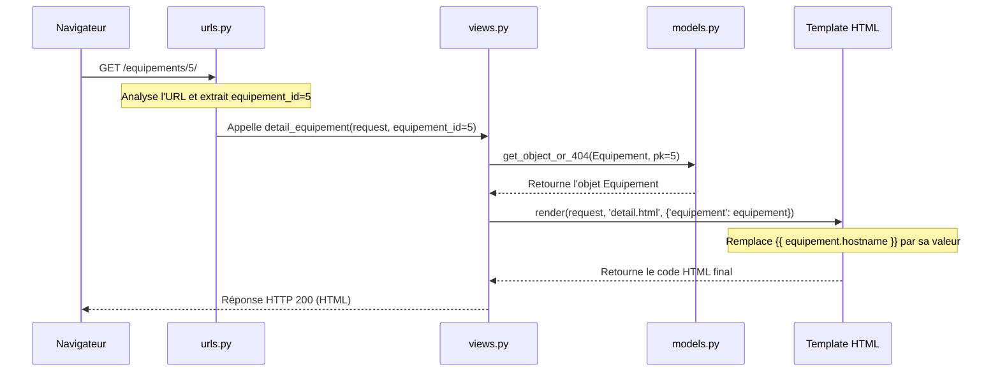

# 4-1-4-Vues (fonctions et classes), URLs, templates Django

Dans l'architecture MTV de Django, une fois que le Modèle a défini la structure des données, il faut pouvoir y accéder via une adresse web (URL), traiter la requête (Vue) et renvoyer une interface visuelle (Template). Ces trois éléments fonctionnent en synergie pour traiter chaque requête HTTP.

## 1. Le routage avec les URLs (`urls.py`)

Le fichier `urls.py` agit comme le standard téléphonique de votre application. Il analyse l'URL demandée par l'utilisateur et la redirige vers la Vue correspondante.

Django utilise la fonction `path()` pour associer une route (sous forme de chaîne de caractères) à une vue. Il est également possible de capturer des paramètres dynamiques directement dans l'URL.

**Exemple de configuration (`parc/urls.py`) :**

```python
from django.urls import path
from . import views

urlpatterns = [
    # Route statique : /equipements/
    path('equipements/', views.liste_equipements, name='liste_equipements'),
    
    # Route dynamique : /equipements/5/ (capture l'entier 5 dans la variable equipement_id)
    path('equipements/<int:equipement_id>/', views.detail_equipement, name='detail_equipement'),
]
```
*L'attribut `name` permet de nommer l'URL, ce qui facilite la création de liens dynamiques dans les templates sans coder les URLs en dur.*

## 2. Les Vues (Views)

La Vue est le centre de contrôle. Elle reçoit la requête HTTP (`request`), interagit avec la base de données via les Modèles si nécessaire, et retourne une réponse HTTP (souvent un Template rendu).

Django propose deux manières d'écrire des vues : les fonctions (FBV) et les classes (CBV).

### A. Vues basées sur des fonctions (FBV - Function-Based Views)

C'est l'approche la plus simple et explicite. Une fonction Python prend un objet `request` en paramètre et retourne une réponse.

```python
# parc/views.py
from django.shortcuts import render, get_object_or_404
from .models import Equipement

def liste_equipements(request):
    # Récupération de tous les équipements depuis la base de données
    equipements = Equipement.objects.all()
    
    # Rendu du template en lui passant les données (le "contexte")
    return render(request, 'parc/liste.html', {'equipements': equipements})

def detail_equipement(request, equipement_id):
    # Récupère l'équipement ou renvoie une erreur 404 s'il n'existe pas
    equipement = get_object_or_404(Equipement, pk=equipement_id)
    return render(request, 'parc/detail.html', {'equipement': equipement})
```

### B. Vues basées sur des classes (CBV - Class-Based Views)

Pour éviter de réécrire le même code (comme lister des objets ou afficher un détail), Django fournit des vues génériques basées sur des classes. Elles favorisent la réutilisabilité et l'héritage.

```python
# parc/views.py
from django.views.generic import ListView, DetailView
from .models import Equipement

class EquipementListView(ListView):
    model = Equipement
    template_name = 'parc/liste.html'
    context_object_name = 'equipements' # Nom de la variable dans le template

class EquipementDetailView(DetailView):
    model = Equipement
    template_name = 'parc/detail.html'
    context_object_name = 'equipement'
```
*Dans `urls.py`, l'appel devient : `path('equipements/', EquipementListView.as_view(), name='liste_equipements')`.*

## 3. Les Templates Django

Le moteur de templates de Django permet de générer du HTML dynamiquement. Il utilise une syntaxe spécifique pour injecter des variables et utiliser des structures de contrôle (boucles, conditions).

**Exemple de template (`parc/templates/parc/liste.html`) :**

```html
<!DOCTYPE html>
<html lang="fr">
<head>
    <title>Liste des équipements</title>
</head>
<body>
    <h1>Mon parc d'équipements</h1>
    
    <ul>
        <!-- Boucle sur la variable 'equipements' passée par la vue -->
        
            <li>
                <!-- Génération dynamique de l'URL grâce au 'name' défini dans urls.py -->
                <a href="">
                    {{ equipement.hostname }}
                </a>
                - Ajouté le {{ equipement.date_ajout|date:"d/m/Y" }}
            </li>
        
            <li>Aucun équipement disponible.</li>
        
    </ul>
</body>
</html>
```
*Note : Le filtre `|date:"d/m/Y"` formate l'affichage de la date directement dans le template.*

## 4. Cycle de traitement d'une requête

Le diagramme suivant détaille le cheminement d'une requête HTTP à travers les URLs, la Vue et le Template.



---
**Sources utilisées :**
*   *Documentation officielle Django (6.0.x) - URL dispatcher* (docs.djangoproject.com/en/stable/topics/http/urls/)
*   *Documentation officielle Django (6.0.x) - Writing views* (docs.djangoproject.com/en/stable/topics/http/views/)
*   *Documentation officielle Django (6.0.x) - Built-in class-based generic views* (docs.djangoproject.com/en/stable/topics/class-based-views/generic-display/)
*   *Documentation officielle Django (6.0.x) - Templates* (docs.djangoproject.com/en/stable/topics/templates/)