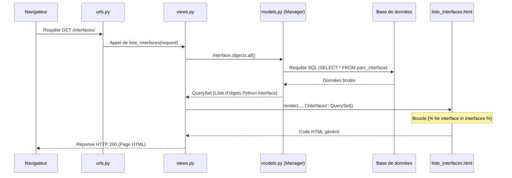

# 4-1-5-Création de pages web simples et gestion des données via l'ORM

L'objectif principal d'une application web dynamique est d'interagir avec une base de données pour afficher, créer, modifier ou supprimer des informations. Ces quatre opérations fondamentales sont regroupées sous l'acronyme **CRUD** (Create, Read, Update, Delete). 

Dans Django, ces opérations sont réalisées grâce à l'ORM (Object-Relational Mapping), qui permet de manipuler les données sous forme d'objets Python directement depuis les Vues.

## 1. Les opérations CRUD avec l'ORM Django

Prenons comme point de départ un modèle `Interface` défini dans `parc/models.py` :

```python
from django.db import models

class Interface(models.Model):
    nom = models.CharField(max_length=200)
    ip = models.CharField(max_length=100)
    vlan = models.IntegerField()

    def __str__(self):
        return f"{self.nom} ({self.ip})"
```

Voici comment effectuer les opérations CRUD via l'ORM (généralement dans le shell Django `python manage.py shell` ou dans une Vue) :

### A. Create (Créer)
Pour ajouter une nouvelle entrée dans la base de données, on instancie l'objet puis on appelle la méthode `.save()`, ou on utilise `.create()`.

```python
# Méthode 1 : Instanciation puis sauvegarde
nouvelle_interface = Interface(nom="GigabitEthernet0/1", ip="192.168.1.10", vlan=10)
nouvelle_interface.save()

# Méthode 2 : Création directe
Interface.objects.create(nom="GigabitEthernet0/2", ip="192.168.1.11", vlan=20)
```

### B. Read (Lire)
L'attribut `objects` (le Manager) permet d'effectuer des requêtes de lecture (SELECT).

```python
# Récupérer toutes les interfaces
toutes_les_interfaces = Interface.objects.all()

# Filtrer les résultats (clause WHERE)
interfaces_vlan_eleve = Interface.objects.filter(vlan__gt=100) # __gt = greater than

# Récupérer un seul objet précis (génère une erreur si 0 ou plusieurs résultats)
interface_precise = Interface.objects.get(id=1)
```

### C. Update (Mettre à jour)
Pour modifier une entrée, on la récupère, on modifie ses attributs, puis on la sauvegarde.

```python
interface = Interface.objects.get(id=1)
interface.vlan = 30
interface.save() # Exécute un UPDATE en SQL
```

### D. Delete (Supprimer)
Pour supprimer une entrée, on appelle la méthode `.delete()` sur l'objet récupéré.

```python
interface = Interface.objects.get(id=1)
interface.delete() # Exécute un DELETE en SQL
```

## 2. Intégration de l'ORM dans une page web

Pour afficher ces données sur une page web, il faut lier l'ORM à une Vue, puis transmettre les données à un Template.

### Étape 1 : La Vue (`parc/views.py`)
La vue interroge la base de données via l'ORM et prépare un dictionnaire de contexte.

```python
from django.shortcuts import render
from .models import Interface

def liste_interfaces(request):
    # Opération READ : on récupère toutes les interfaces
    interfaces = Interface.objects.all()
    
    # On passe les données au template via le contexte
    contexte = {'interfaces': interfaces}
    return render(request, 'parc/liste_interfaces.html', contexte)
```

### Étape 2 : Le routage (`parc/urls.py`)
On associe une URL à cette vue.

```python
from django.urls import path
from . import views

urlpatterns = [
    path('interfaces/', views.liste_interfaces, name='liste_interfaces'),
]
```

### Étape 3 : Le Template (`parc/templates/parc/liste_interfaces.html`)
Le template itère sur les données reçues pour générer le HTML.

```html
<!DOCTYPE html>
<html lang="fr">
<head>
    <meta charset="UTF-8">
    <title>Liste des interfaces</title>
</head>
<body>
    <h1>Nos interfaces réseau</h1>
    <ul>
        
            <li><strong>{{ interface.nom }}</strong> (VLAN {{ interface.vlan }}) - <em>{{ interface.ip }}</em></li>
        
            <li>Aucune interface dans l'inventaire pour le moment.</li>
        
    </ul>
</body>
</html>
```

## 3. Flux d'une opération de lecture (Read)

Le diagramme suivant illustre le cheminement des données lors de l'affichage de la page web créée ci-dessus.



---
**Sources utilisées :**
*   *Documentation officielle Django (6.0.x) - Making queries* (docs.djangoproject.com/en/stable/topics/db/queries/)
*   *Documentation officielle Django (6.0.x) - QuerySet API reference* (docs.djangoproject.com/en/stable/ref/models/querysets/)
*   *Unwired Learning - Django ORM CRUD Tutorial* (unwiredlearning.com/blog/django-orm-crud)