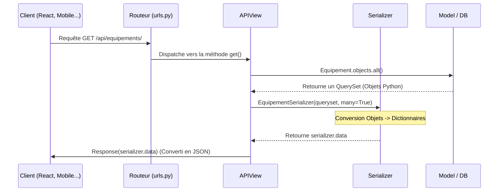

# 4-2-1-Introduction à Django REST Framework (DRF) : sérialiseurs, vues d'API

Django REST Framework (DRF) est une bibliothèque puissante et flexible construite par-dessus Django, conçue spécifiquement pour développer des API Web (Application Programming Interfaces). 

Alors que Django classique génère du HTML pour des navigateurs web, DRF permet à votre application de communiquer avec n'importe quel client (application mobile, framework front-end comme React ou Vue.js, ou d'autres serveurs) en échangeant des données structurées, généralement au format **JSON**.

## 1. Les Sérialiseurs (Serializers)

Dans une API, les données transitent sous forme de texte (JSON). Cependant, dans Django, les données sont manipulées sous forme d'objets Python complexes (les instances de Modèles). 

Le **Sérialiseur** agit comme un traducteur bidirectionnel :
*   **Sérialisation (Lecture) :** Il convertit les objets Django (Modèles, QuerySets) en types de données natifs Python (dictionnaires), qui sont ensuite facilement transformés en JSON.
*   **Désérialisation (Écriture) :** Il valide les données JSON entrantes et les convertit en objets Django pour les sauvegarder dans la base de données.

**Exemple : Création d'un sérialiseur avec `ModelSerializer`**
DRF propose `ModelSerializer`, un raccourci qui génère automatiquement un sérialiseur basé sur un modèle existant.

```python
# parc/serializers.py
from rest_framework import serializers
from .models import Equipement

class EquipementSerializer(serializers.ModelSerializer):
    class Meta:
        model = Equipement
        # Définition des champs à exposer dans l'API
        fields = ['id', 'hostname', 'description', 'date_ajout', 'actif']
```

## 2. Les Vues d'API (API Views)

Les vues dans DRF ont le même rôle que dans Django classique : recevoir une requête et retourner une réponse. Cependant, au lieu de retourner un objet `HttpResponse` contenant du HTML, elles retournent un objet `Response` de DRF, qui formate automatiquement les données en JSON.

DRF propose deux approches principales pour écrire des vues :

### A. Vues basées sur des fonctions (avec le décorateur `@api_view`)
Idéal pour des logiques simples ou personnalisées.

```python
# parc/views.py
from rest_framework.decorators import api_view
from rest_framework.response import Response
from .models import Equipement
from .serializers import EquipementSerializer

@api_view(['GET'])
def liste_equipements_api(request):
    equipements = Equipement.objects.all()
    # many=True indique qu'on sérialise une liste d'objets (QuerySet)
    serializer = EquipementSerializer(equipements, many=True)
    return Response(serializer.data)
```

### B. Vues basées sur des classes (`APIView`)
L'approche recommandée pour structurer des API RESTful (CRUD). `APIView` est la classe de base, et les méthodes HTTP (`get`, `post`, `put`, `delete`) y sont définies explicitement.

```python
# parc/views.py
from rest_framework.views import APIView
from rest_framework.response import Response
from rest_framework import status
from .models import Equipement
from .serializers import EquipementSerializer

class EquipementListAPIView(APIView):
    # Gère la requête GET (Lecture)
    def get(self, request):
        equipements = Equipement.objects.all()
        serializer = EquipementSerializer(equipements, many=True)
        return Response(serializer.data)

    # Gère la requête POST (Création)
    def post(self, request):
        serializer = EquipementSerializer(data=request.data)
        if serializer.is_valid(): # Validation des données entrantes
            serializer.save()     # Sauvegarde en base de données
            return Response(serializer.data, status=status.HTTP_201_CREATED)
        return Response(serializer.errors, status=status.HTTP_400_BAD_REQUEST)
```

## 3. Flux de traitement d'une requête API avec DRF

Le diagramme suivant illustre comment les composants de DRF interagissent pour traiter une requête de lecture (GET).



---
**Sources utilisées :**
*   *Documentation officielle Django REST Framework - Serializers* (django-rest-framework.org/api-guide/serializers/)
*   *Documentation officielle Django REST Framework - Views* (django-rest-framework.org/api-guide/views/)
*   *Tutoriel officiel DRF - Part 1: Serialization* (django-rest-framework.org/tutorial/1-serialization/)