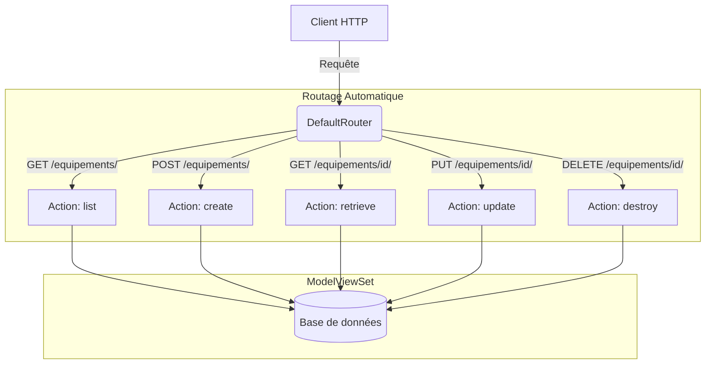

# 4-2-2-Création d'APIs RESTful avec DRF pour les modèles existants

Lorsqu'il s'agit d'exposer des modèles de base de données existants via une API RESTful, écrire manuellement chaque méthode (GET, POST, PUT, DELETE) avec `APIView` peut rapidement devenir répétitif. Django REST Framework (DRF) propose une abstraction puissante pour automatiser ce processus : les **ViewSets** combinés aux **Routeurs**.

## 1. Les ViewSets (`ModelViewSet`)

Un `ViewSet` est une classe qui regroupe la logique de plusieurs vues liées à une même ressource (un modèle). Au lieu de définir des méthodes HTTP (`get()`, `post()`), un ViewSet définit des actions (`list()`, `retrieve()`, `create()`, `update()`, `destroy()`).

Pour un modèle existant, la classe `ModelViewSet` est la plus adaptée. Elle fournit automatiquement l'implémentation complète des opérations CRUD (Create, Read, Update, Delete) en se basant sur le modèle et le sérialiseur fournis.

**Exemple : Création d'un ViewSet pour le modèle `Equipement`**

```python
# parc/views.py
from rest_framework import viewsets
from .models import Equipement
from .serializers import EquipementSerializer

class EquipementViewSet(viewsets.ModelViewSet):
    """
    Ce ViewSet fournit automatiquement les actions :
    - 'list' (GET /equipements/)
    - 'retrieve' (GET /equipements/{id}/)
    - 'create' (POST /equipements/)
    - 'update' (PUT /equipements/{id}/)
    - 'destroy' (DELETE /equipements/{id}/)
    """
    queryset = Equipement.objects.all()
    serializer_class = EquipementSerializer
```

Avec ces trois lignes de code, toute la logique métier pour manipuler les équipements via l'API est opérationnelle.

## 2. Les Routeurs (`DefaultRouter`)

Puisqu'un `ViewSet` ne définit pas directement de méthodes HTTP, il ne peut pas être lié à une URL classique avec `path()`. C'est ici qu'interviennent les **Routeurs**.

Un routeur génère automatiquement la configuration des URLs (le routage) pour un ViewSet, en associant les méthodes HTTP aux actions correspondantes.

**Exemple : Configuration du routeur**

```python
# parc/urls.py
from django.urls import path, include
from rest_framework.routers import DefaultRouter
from .views import EquipementViewSet

# 1. Instanciation du routeur
router = DefaultRouter()

# 2. Enregistrement du ViewSet avec un préfixe d'URL ('equipements')
router.register(r'equipements', EquipementViewSet, basename='equipement')

# 3. Inclusion des URLs générées par le routeur dans les urlpatterns
urlpatterns = [
    path('api/', include(router.urls)),
]
```

Le `DefaultRouter` génère automatiquement les routes suivantes :
*   `GET /api/equipements/` : Liste tous les équipements.
*   `POST /api/equipements/` : Crée un nouvel équipement.
*   `GET /api/equipements/5/` : Récupère les détails de l'équipement avec l'ID 5.
*   `PUT /api/equipements/5/` : Met à jour l'équipement avec l'ID 5.
*   `DELETE /api/equipements/5/` : Supprime l'équipement avec l'ID 5.

De plus, `DefaultRouter` génère une page d'accueil (API Root) listant tous les endpoints disponibles, ce qui facilite l'exploration de l'API depuis un navigateur.

## 3. Architecture du routage avec ViewSets

Le diagramme suivant illustre comment le routeur intercepte la requête HTTP et la redirige vers l'action appropriée du `ModelViewSet`.



---
**Sources utilisées :**
*   *Documentation officielle Django REST Framework - Viewsets* (django-rest-framework.org/api-guide/viewsets/)
*   *Documentation officielle Django REST Framework - Routers* (django-rest-framework.org/api-guide/routers/)
*   *Tutoriel officiel DRF - Part 6: Viewsets & Routers* (django-rest-framework.org/tutorial/6-viewsets-and-routers/)