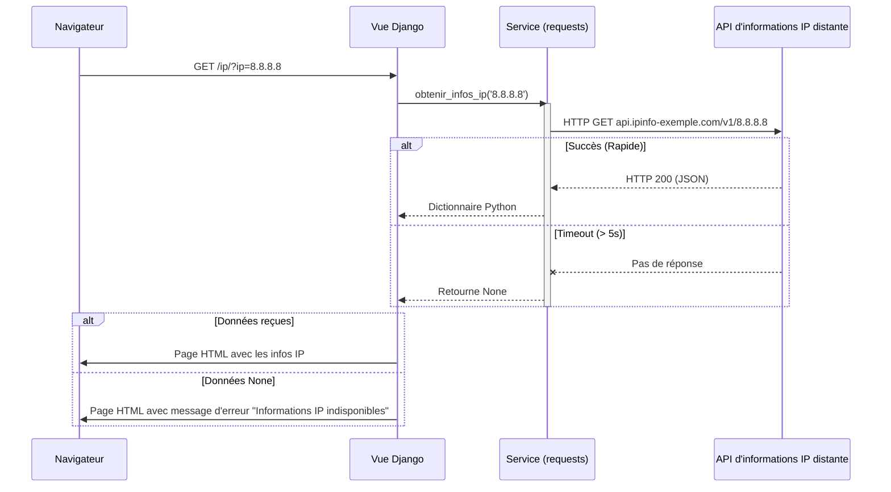

# 4-2-3-Consommation d'APIs externes depuis une application Django

Une application Django n'est pas toujours isolée. Elle a souvent besoin de communiquer avec d'autres services pour enrichir ses propres données : géolocaliser une adresse IP publique, interroger un service de réputation d'adresses IP, effectuer une résolution WHOIS d'un nom de domaine, ou récupérer l'inventaire d'un outil de supervision tiers.

Pour effectuer ces requêtes HTTP vers l'extérieur, l'outil standard dans l'écosystème Python est la bibliothèque tierce **`requests`**.

## 1. La bibliothèque `requests`

Bien que Python possède des modules natifs pour les requêtes HTTP (`urllib`), la bibliothèque `requests` est le standard de facto grâce à sa syntaxe simple et intuitive.

**Installation :**
```bash
pip install requests
```

**Utilisation basique :**
```python
import requests

# Requête GET simple
reponse = requests.get('https://api.github.com/users/octocat')

# Vérification du statut HTTP (200 = OK)
if reponse.status_code == 200:
    # Conversion automatique du JSON en dictionnaire Python
    donnees = reponse.json() 
```

## 2. Intégration dans Django : Les bonnes pratiques

Intégrer des appels externes dans une application web nécessite de prendre des précautions pour ne pas bloquer le serveur ou planter l'application si l'API distante est indisponible.

### A. Séparation des responsabilités (Le pattern Service)
Il est fortement déconseillé d'écrire la logique d'appel API directement dans vos Vues (`views.py`). La bonne pratique consiste à créer un fichier `services.py` dédié à la communication externe. Cela rend le code réutilisable et plus facile à tester.

### B. Gestion des erreurs et Timeouts
Si l'API externe met 30 secondes à répondre, votre vue Django mettra 30 secondes à s'afficher, bloquant potentiellement un *worker* de votre serveur. Il faut **toujours** définir un `timeout` et gérer les exceptions.

## 3. Exemple concret : Récupérer les informations d'une adresse IP

Imaginons que nous voulions afficher des informations sur une adresse IP publique (géolocalisation, opérateur) sur notre site Django en utilisant une API publique.

**Étape 1 : Le Service (`reseau/services.py`)**

```python
import requests
from requests.exceptions import RequestException

def obtenir_infos_ip(ip):
    """
    Interroge une API externe pour obtenir des informations sur une adresse IP.
    Retourne un dictionnaire avec les données ou None en cas d'erreur.
    """
    url = f"https://api.ipinfo-exemple.com/v1/{ip}"
    
    try:
        # timeout=5 : abandonne si le serveur ne répond pas dans les 5 secondes
        reponse = requests.get(url, timeout=5)
        
        # Lève une exception si le statut HTTP est une erreur (4xx ou 5xx)
        reponse.raise_for_status()
        
        return reponse.json()
        
    except requests.exceptions.Timeout:
        # Gérer le cas où l'API est trop lente
        print(f"L'API d'informations IP a mis trop de temps à répondre pour {ip}.")
        return None
    except requests.exceptions.RequestException as e:
        # Gérer toutes les autres erreurs (problème réseau, erreur 404, 500...)
        print(f"Erreur lors de l'appel à l'API d'informations IP : {e}")
        return None
```

**Étape 2 : La Vue (`reseau/views.py`)**

La vue appelle le service et gère l'affichage selon que les données sont disponibles ou non.

```python
from django.shortcuts import render
from .services import obtenir_infos_ip

def page_infos_ip(request):
    ip_demandee = request.GET.get('ip', '8.8.8.8')
    
    # Appel au service externe
    donnees_ip = obtenir_infos_ip(ip_demandee)
    
    contexte = {
        'ip': ip_demandee,
        'infos': donnees_ip,
        'erreur': donnees_ip is None
    }
    
    return render(request, 'reseau/affichage.html', contexte)
```

## 4. Flux d'une requête impliquant une API externe

Le diagramme suivant montre comment Django agit comme un intermédiaire (client) vis-à-vis de l'API externe, tout en étant le serveur pour le navigateur de l'utilisateur.



---
**Sources utilisées :**
*   *Documentation officielle de la bibliothèque `requests`* (requests.readthedocs.io/en/latest/)
*   *Reintech - Connecting to an External API in Django* (reintech.io/blog/connecting-to-external-api-in-django)
*   *HackerNoon - 5 Best Practices for Integrating with External APIs* (hackernoon.com/5-best-practices-for-integrating-with-external-apis)