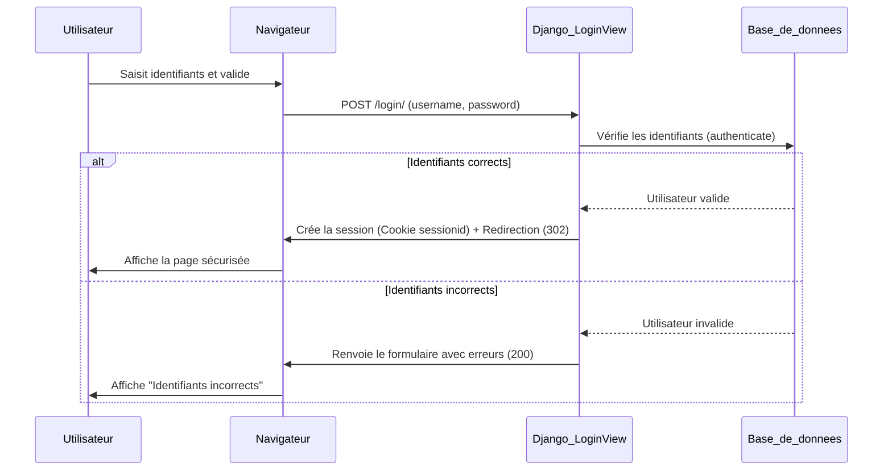

# 4-2-4-Mise en place d'utilisateurs Django, formulaires de login/logout

Django intègre nativement un système d'authentification robuste et sécurisé via le module `django.contrib.auth`. Ce système gère les utilisateurs, les groupes, les permissions, ainsi que les sessions basées sur les cookies. 

Plutôt que de recréer la logique de connexion et de déconnexion de zéro, Django fournit des vues génériques prêtes à l'emploi (`LoginView` et `LogoutView`) qui gèrent la validation des formulaires et la création des sessions.

## 1. Configuration des URLs d'authentification

La première étape consiste à lier les vues d'authentification intégrées de Django à vos URLs.

**Fichier `urls.py` de votre application (ex: `comptes/urls.py`) :**

```python
from django.urls import path
from django.contrib.auth.views import LoginView, LogoutView

urlpatterns = [
    # Utilisation de la vue générique LoginView
    path('login/', LoginView.as_view(template_name='comptes/login.html'), name='login'),
    
    # Utilisation de la vue générique LogoutView
    # next_page redirige l'utilisateur après la déconnexion
    path('logout/', LogoutView.as_view(next_page='login'), name='logout'),
]
```

*Note : Depuis Django 5.0, la déconnexion via une requête GET (en visitant simplement l'URL `/logout/`) est dépréciée pour des raisons de sécurité. Il est recommandé d'utiliser une requête POST (via un formulaire) pour se déconnecter.*

## 2. Le formulaire et le template de connexion (Login)

La vue `LoginView` transmet automatiquement un formulaire d'authentification (`AuthenticationForm`) au template sous la variable `form`. Il suffit de l'afficher.

**Fichier `comptes/templates/comptes/login.html` :**

```html
<!DOCTYPE html>
<html lang="fr">
<head>
    <title>Connexion</title>
</head>
<body>
    <h2>Se connecter</h2>
    
    <!-- Le formulaire envoie une requête POST à l'URL courante -->
    <form method="post">
        <!-- Protection obligatoire contre les failles CSRF -->
        
        
        <!-- Affichage automatique des champs (nom d'utilisateur et mot de passe) -->
        {{ form.as_p }}
        
        <button type="submit">Connexion</button>
    </form>
</body>
</html>
```

### Redirection après connexion
Par défaut, après une connexion réussie, Django redirige vers l'URL `/accounts/profile/`. Pour modifier ce comportement, définissez la variable `LOGIN_REDIRECT_URL` dans le fichier `settings.py` :

```python
# settings.py
LOGIN_REDIRECT_URL = '/' # Redirige vers la page d'accueil
LOGOUT_REDIRECT_URL = '/login/' # Redirige vers la page de connexion après déconnexion
```

## 3. Déconnexion (Logout)

Pour se déconnecter de manière sécurisée (via POST), on utilise un petit formulaire dans le template (par exemple, dans la barre de navigation).

```html
<!-- Bouton de déconnexion sécurisé -->
<form action="" method="post">
    
    <button type="submit">Se déconnecter</button>
</form>
```

## 4. Restreindre l'accès aux pages (Protéger les Vues)

Une fois le système d'authentification en place, il faut empêcher les utilisateurs non connectés d'accéder à certaines pages.

### A. Pour les vues basées sur des fonctions (FBV)
On utilise le décorateur `@login_required`.

```python
from django.contrib.auth.decorators import login_required
from django.shortcuts import render

@login_required
def tableau_de_bord(request):
    # Cette vue n'est accessible qu'aux utilisateurs connectés
    # request.user contient l'objet de l'utilisateur actuel
    return render(request, 'comptes/dashboard.html', {'utilisateur': request.user})
```

### B. Pour les vues basées sur des classes (CBV)
On utilise le mixin `LoginRequiredMixin`, qui doit être placé en premier dans l'héritage.

```python
from django.contrib.auth.mixins import LoginRequiredMixin
from django.views.generic import TemplateView

class TableauDeBordView(LoginRequiredMixin, TemplateView):
    template_name = 'comptes/dashboard.html'
```

*Si un utilisateur non connecté tente d'accéder à ces vues, il sera automatiquement redirigé vers la page de connexion (définie par `LOGIN_URL` dans `settings.py`).*

## 5. Flux d'authentification

Le diagramme suivant illustre le processus de connexion et la gestion de la session.



---
**Sources utilisées :**
*   *Documentation officielle Django (6.0.x) - Using the Django authentication system* (docs.djangoproject.com/en/stable/topics/auth/default/)
*   *Documentation officielle Django (6.0.x) - Django authentication views* (docs.djangoproject.com/en/stable/topics/auth/default/#module-django.contrib.auth.views)
*   *MDN Web Docs - Django Tutorial Part 8: User authentication and permissions* (developer.mozilla.org/en-US/docs/Learn/Server-side/Django/Authentication)