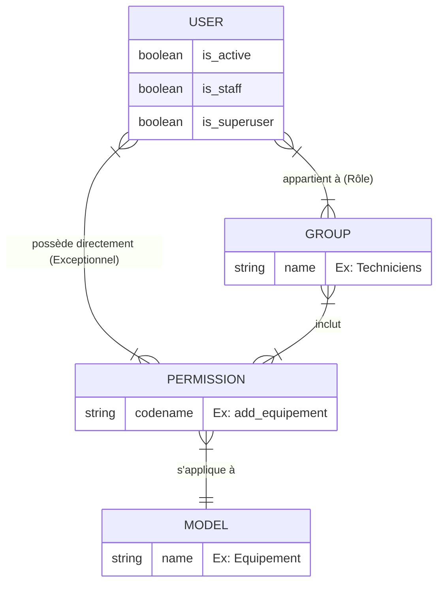

# 4-2-5-Gestion des rôles simple (ex: staff, admin, utilisateurs normaux) via les permissions Django

L'authentification permet de savoir *qui* est l'utilisateur. L'**autorisation** (ou gestion des permissions) permet de déterminer *ce qu'il a le droit de faire*. 

Django intègre un système de permissions granulaire basé sur les modèles, couplé à un système de groupes pour faciliter la gestion des rôles.

## 1. Les statuts d'utilisateurs natifs

Le modèle `User` de Django possède trois attributs booléens fondamentaux qui définissent les niveaux d'accès de base :

*   **`is_active` (Utilisateur normal) :** L'utilisateur peut se connecter au site public. S'il est passé à `False`, le compte est désactivé sans être supprimé de la base de données.
*   **`is_staff` (Membre de l'équipe) :** L'utilisateur est autorisé à se connecter à l'interface d'administration de Django (`/admin/`). Cependant, il ne verra et ne pourra modifier que les données pour lesquelles il a reçu des permissions explicites.
*   **`is_superuser` (Administrateur suprême) :** L'utilisateur possède implicitement **toutes** les permissions du système. Les vérifications de permissions sont ignorées pour lui.

## 2. Les Permissions par défaut

Dès que vous créez un modèle (par exemple, un modèle `Equipement` dans une application `parc`), Django génère automatiquement quatre permissions de base en base de données :

1.  `add_equipement` (Créer)
2.  `view_equipement` (Lire)
3.  `change_equipement` (Modifier)
4.  `delete_equipement` (Supprimer)

La nomenclature standard d'une permission dans Django est : `<nom_application>.<action>_<nom_modele>`. 
*Exemple : `parc.change_equipement`.*

## 3. Les Groupes : Créer des rôles personnalisés

Il est possible d'assigner des permissions directement à un utilisateur. Cependant, la bonne pratique consiste à utiliser les **Groupes**. Un groupe agit comme un "Rôle" (ex: Techniciens, Superviseurs, Auditeurs). 

On assigne les permissions au groupe, puis on ajoute les utilisateurs à ce groupe. Si les droits d'un rôle évoluent, il suffit de modifier le groupe pour que tous ses membres soient mis à jour.

**Exemple : Création d'un rôle "Technicien" via le shell Django ou un script d'initialisation**

```python
from django.contrib.auth.models import Group, Permission, User
from django.contrib.contenttypes.models import ContentType
from parc.models import Equipement

# 1. Création du groupe (Rôle)
groupe_techniciens, created = Group.objects.get_or_create(name='Techniciens')

# 2. Récupération des permissions liées au modèle Equipement
content_type = ContentType.objects.get_for_model(Equipement)
permissions = Permission.objects.filter(
    content_type=content_type,
    codename__in=['add_equipement', 'change_equipement', 'view_equipement'] # Pas le droit de supprimer
)

# 3. Assignation des permissions au groupe
groupe_techniciens.permissions.set(permissions)

# 4. Ajout d'un utilisateur existant à ce groupe
utilisateur = User.objects.get(username='alice')
utilisateur.groups.add(groupe_techniciens)
```

*Note : Cette gestion des groupes et permissions peut également se faire entièrement via l'interface d'administration de Django, sans écrire de code.*

## 4. Vérification des permissions dans les Vues

Pour sécuriser votre application, vous devez vérifier que l'utilisateur possède la permission requise avant d'exécuter la logique d'une vue.

### A. Vues basées sur des fonctions (FBV)
On utilise le décorateur `@permission_required`.

```python
from django.contrib.auth.decorators import permission_required
from django.shortcuts import render

# raise_exception=True renvoie une erreur 403 (Accès refusé) au lieu de rediriger vers le login
@permission_required('parc.add_equipement', raise_exception=True)
def creer_equipement(request):
    # Seuls les superusers ou les utilisateurs ayant la permission 'add_equipement' accèdent ici
    return render(request, 'parc/creer_equipement.html')
```

### B. Vues basées sur des classes (CBV)
On utilise le mixin `PermissionRequiredMixin`, qui doit être placé en premier dans l'héritage.

```python
from django.contrib.auth.mixins import PermissionRequiredMixin
from django.views.generic import CreateView
from .models import Equipement

class EquipementCreateView(PermissionRequiredMixin, CreateView):
    model = Equipement
    fields = ['hostname', 'description']
    template_name = 'parc/creer_equipement.html'
    
    # Définition de la permission requise
    permission_required = 'parc.add_equipement'
    raise_exception = True 
```

## 5. Architecture relationnelle des rôles et permissions

Le diagramme suivant illustre comment les utilisateurs, les groupes et les permissions sont liés dans la base de données de Django.



---
**Sources utilisées :**
*   *Documentation officielle Django (6.0.x) - Using the Django authentication system (Permissions and authorization)* (docs.djangoproject.com/en/stable/topics/auth/default/#permissions-and-authorization)
*   *Documentation officielle Django (6.0.x) - Customizing authentication in Django* (docs.djangoproject.com/en/stable/topics/auth/customizing/)
*   *TestDriven.io - Permissions in Django* (testdriven.io/blog/django-permissions/)